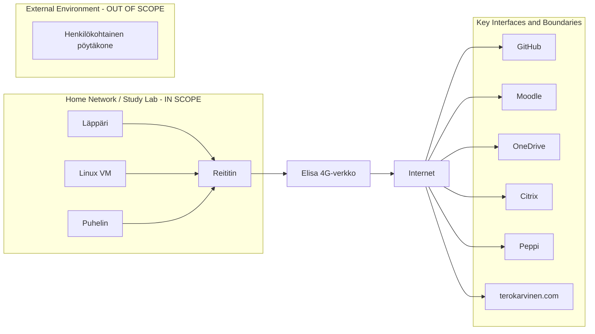

# Freedom of Action, Control, and Risk Mitigation

## a) Basic Level

### a1) Kotiverkkoni infrastruktuuri
Kotiverkkooni kuuluvat seuraavat laitteet:

ZTE 4G reitin 
- Mallia MF286R
- internet-palveluntarjoajana Elisa
- Palomuuri käytössä

Wi-Fi-verkko 
- SSID: 4G-Gateway-5CD55C
- Protokolla: Wi-Fi 5 (802.11ac)
- Suojaustyyppi: WPA2-Personal

Läppäri
- LENOVO ThinkPad E16 Gen 2
- OS: Microsoft Windows 11 Pro (automaattiset päivitykset käytössä)
- Windows Defender Firewall käytössä
- McAfee virustorjunta käytössä
- Käyttäjällä administrator-oikeudet
- Koneella tehdään kurssiharjoituksia

Linux virtuaalikone
- VirtualBoxin kautta käytössä Linuxin Debian-distro (64-bit)
- NAT
- UFW-palomuuri käytössä
- Käyttäjällä sudo-oikeudet
- Koneella tehdään kurssin labraharjoituksia

Puhelin
- iPhone 13
- iOS 18.6.2 (ei päivitetty tilan puutteen vuoksi, voi muodostaa tietoturvariskin)
- Internet-palveluntarjoajana Elisa
- 4G verkkoyhteys
- MFA käytössä (Microsoft Authenticator)

Läppäriä käytetään pääsääntöisesti vain koulutehtäviin ja sisältää niihin liittyviä tiedostoja, dataa ja Github-repositorioita. Puhelin sisältää yksityisiä tiedostoja ja muuta dataa, jotka eivät liity kurssitehtäviin. Molemmilla laitteilla on käytössä Googlen salasananhallintaohjelma. Linux-virtuaalikone on käytössä vain kurssin labraharjoituksiin.

### a2) Rajauksen ulkopuolella olevat kotiverkon laitteet

Oma henkilökohtainen pöytäkoneeni on rajattu pois, sillä en suorita sillä kurssin tehtäviä, vaan käytän työkoneenani em. läppäriä. Koneella ei käsitellä kurssiin liittyviä tietoja, joten laite ei ole tämän ISMS:n kannalta oleellinen.

### a3) Keskeiset rajapinnat ja rajaukset

Läppärillä on käytössä pilvipalvelut Github sekä OneDrive. Käytössä on myös Haaga-Helian kurssisivusto Moodle, opettajan Tero Karvinen nettisivut sekä opiskelijahallintojärjestelmä Peppi. Käytössä on toisinaan myös Citrix, jolta saa etäyhteyden Haaga-Helian virtuaalikoneelle. VPN eikä SSH ole tällä hetkellä käytössä millään laitteilla.

Kotiverkon ja internetin rajapinta muodostuu reitittimen kautta. Laitteet yhdistyvät reitittimeen Wi-Fi:n kautta, ja siten palveluntarjoaja välittää tietoliikenteen oman verkkonsa kautta internettiin. Läppärillä on käytössä yksityinen IP-osoite. Linux-virtuaalikoneella on oma yksityinen NAT-osoite.
Linux-virtuaalikoneella on käytössä UFW-palomuuri, joka noudattaa tällä hetkellä oletusasetuksia (ei tarkemmin konfiguroitu). Läppärillä on käytössä Windows Defender Firewall. Reitittimellä on palomuuri käytössä, mutta sen ominaisuudet (porttisuodatus, portin uudelleenohjaus, URL-suodatus, UPnP, DMZ) eivät ole tällä hetkellä konfiguroitu.

Minulla on käytössä sekä puhelimessa että läppärissä Elisa palveluntarjoajana. Laitetoimittajia ovat ZTE (reititin), Lenovo (läppäri) ja Apple (puhelin). Pilvipalveluiden tarjoajia ovat GitHub, OneDrive, Google, Moodle, Peppi ja Citrix. Näiden mainittujen teknologioiden ja ulkoisten palveluiden infrastruktuuri ei ole suoraan oman ISMS:n hallinnassani, mutta voin kongifiroida laitteita omiin tarpeisiini sopiviksi.

### Verkko- ja rajapintakaavio

###

# Mitä todisteita voin esittää?

Kuvankaappaus ZTE:n reitittimen tiedoista:

Kuvakaappaus Wi-Fi-yhteyden tiedoista:

Kuvankaappaus laitteen olennaisista spekseistä, kuten käyttöjärjestelmä ja malli:

Tiedot VirtualBoxin kautta käytetystä Linux-virtuaalikoneesta (Debian-distro):

Kuvankaappaus reitittimen tiedoista saatuun listaukseen reitittimeen tällä hetkellä yhdistetyistä laitteista:

Linkki repositorioon, johon teen kurssitehtävät:

https://github.com/mari-sku/hakkerointi

# b) Standardien osapuolet 

Valitsen osapuoliksi tähän tehtävään itseni sekä Haaga-Helian (kurssin tarjoajan). 

| Osapuolet (Interested Parties) | Tarve tai vaatimus | ISO 27001 vaatimusalue | Miten vaatimusten noudattaminen osoitetaan |
|---|---|---|---|
| Minä (opiskelija) | Kurssiharjoitusten jatkuvuus ja  tietojen suojaaminen. Kurssilla opittujen asioiden käyttäminen lainmukaisesti, eettisesti ja ennaltasovitusti. | Suunnittelu | Laitelistauksen pitäminen ajan tasalla. Tietoturvariskien tiedostaminen. Käyttäjien (Windows, Linux, Haaga-Helian tunnusten) pitäminen suojassa vahvan salasanan ja MFA:n takana. Github repositorion ylläpito. Käyttöjärjestelmän, palomuurin sekä virustorjunnan pitäminen pävivitettynä. Eettisten ja lainmukaisten hackerointiperiaatteiden hyväksyminen ja noudattaminen |
| Haaga-Helia / kurssin järjestäjä | Haaga-Helian prosessien kriteerien mukaan toimiminen. Kurssiin liittyvien resurssien järjestäminen. Opettajien tietoturvaosaamisen varmistus. Tietoturvariskien ehkäisy. | Toiminta | Kurssin järjestelyt Pepissä, Moodlessa sekä terokarvinen.com -sivustolla. Turvallisen hackeroinnin labraympäristön (VM) pystyttämisen ohjeenanto. Opetusmateriaalien ja kurssiin liittyvien tietojen pitäminen ajan tasalla. Tietoturvariskien hallinta, arviointi ja käsittely |

# Lähteet

Joaquin, L. 02.04.2026. What Is a Router and How It Works: Your Ultimate Guide. Omada Networksin blogi. Luettavissa:
https://www.omadanetworks.com/ph/blog/2342/what-is-a-router-and-how-it-works-your-ultimate-guide/ Luettu 24.08.2026.

SFS, 04.08.2023.SFS-EN ISO/IEC 27001:2023. Tietoturvallisuus, kyberturvallisuus ja tietosuoja. Tietoturvallisuuden hallintajärjestelmät. Vaatimukset. Helsinki. Luettu 24.08.2026.

Harjoituksessa on käytetty Chat GPT-5.6 Luna -kielimallia kääntämään ja lokalisoimaan tehtävänannon tietoteknisiä termejä englannista suomeksi. Tekoälyä on myös käytetty markdownin syntaksin mukaisen mermaid-kaavion sekä taulukon luomisessa, mutta ei niiden tekstisisältöjen luomisessa.

