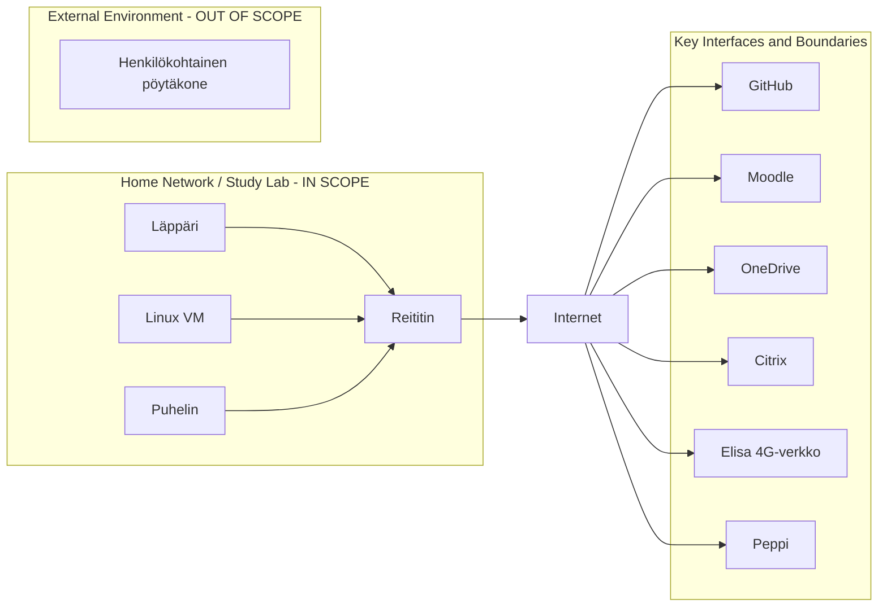

# Freedom of Action, Control, and Risk Mitigation

## a) Basic Level

### a1) Kotiverkkoni infrastruktuuri
Kotiverkkooni kuuluvat seuraavat laitteet:

ZTE 4G reitin 
- Mallia MF286R
- internet-palveluntarjoajana Elisa
- Palomuuri käytössä

Wi-Fi-verkko 
- SSID: 4G-Gateway-5CD55C
- Protokolla: Wi-Fi 5 (802.11ac)
- Suojaustyyppi: WPA2-Personal

Läppäri
- LENOVO ThinkPad E16 Gen 2
- 
- OS: Microsoft Windows 11 Pro (automaattiset päivitykset käytössä)
- Windows Defender Firewall käytössä
- McAfee virustorjunta käytössä
- Käyttäjällä administrator-oikeudet
- Koneella tehdään kurssiharjoituksia

Linux virtuaalikone
- VirtualBoxin kautta käytössä Linuxin Debian-distro (64-bit)
- NAT
- UFW-palomuuri käytössä
- Käyttäjällä sudo-oikeudet
- Koneella tehdään kurssin labraharjoituksia

Puhelin
- iPhone 13
- iOS 18.6.2 (ei päivitetty tilan puutteen vuoksi)
- Internet-palveluntarjoajana Elisa
- 4G verkkoyhteys
- MFA käytössä (Microsoft Authenticator)

Läppäriä käytetään pääsääntöisesti vain koulutehtäviin ja sisältää niihin liittyviä tiedostoja, dataa ja Github-repositorioita. Puhelin sisältää yksityisiä tiedostoja ja muuta dataa, jotka eivät liity kurssitehtäviin. Molemmilla laitteilla on käytössä Googlen salasananhallintaohjelma. Linux-virtuaalikone on käytössä vain kurssin labraharjoituksiin.

### a2) Rajauksen ulkopuolella olevat kotiverkon laitteet

Oma henkilökohtainen pöytäkoneeni on rajattu pois, sillä en suorita sillä kurssin tehtäviä, vaan käytän työkoneenani em. läppäriä. Koneella ei käsitellä kurssiin liittyviä tietoja, joten laite ei ole tämän ISMS:n kannalta oleellinen.

### a3) Keskeiset rajapinnat ja rajaukset

Läppärillä on käytössä pilvipalvelut Github sekä OneDrive. Käytössä on myös Haaga-Helian kurssisivusto Moodle sekä opiskelijahallintojärjestelmä Peppi. Käytössä on toisinaan myös Citrix, jolta saa etäyhteyden Haaga-Helian virtuaalikoneelle. VPN eikä SSH ole tällä hetkellä käytössä millään laitteilla.

Kotiverkon ja internetin rajapinta muodostuu reitittimen kautta. Laitteet yhdistyvät reitittimeen Wi-Fi:n kautta, ja siten palveluntarjoaja välittää tietoliikenteen oman verkkonsa kautta internettiin. Läppärillä on käytössä yksityinen IP-osoite. Linux-virtuaalikoneella on oma yksityinen NAT-osoite.
Linux-virtuaalikoneella on käytössä UFW-palomuuri, joka noudattaa tällä hetkellä oletusasetuksia (ei tarkemmin konfiguroitu). Läppärillä on käytössä Windows Defender Firewall. Reitittimellä on palomuuri käytössä, mutta sen ominaisuudet (porttisuodatus, portin uudelleenohjaus, URL-suodatus, UPnP, DMZ) eivät ole tällä hetkellä konfiguroitu.

Minulla on käytössä sekä puhelimessa että läppärissä Elisa palveluntarjoajana. Laitetoimittajia ovat ZTE (reititin), Lenovo (läppäri) ja Apple (puhelin). Pilvipalveluiden tarjoajia ovat GitHub, OneDrive, Google, Moodle, Peppi ja Citrix. Näiden mainittujen teknologioiden ja ulkoisten palveluiden infrastruktuuri ei ole suoraan oman ISMS:n hallinnassani, mutta voin kongifiroida laitteita omiin tarpeisiini sopiviksi.

### Network and interface diagram

###

# Evidence Addendum

# Lähteet

https://www.omadanetworks.com/ph/blog/2342/what-is-a-router-and-how-it-works-your-ultimate-guide/

