# H3 No Strings Attached

## a) passtr-tiedoston salasana ja strings-komennon käyttö
Lähdetään hakkeroimaan!

Latasin ensin Tero Karvisen sivuilta löytyvän harjoitustehtävän `ezbin-challenges.zip`. Purin zip-tiedoston ja navigoin sinne ajamaan ohjelman `passtr`. Ohjelma kysyy salasanaa, jota en luonnollisestikaan tiedä.

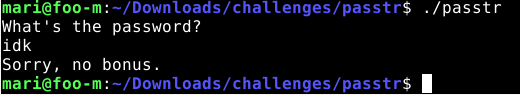

Yritin myös uteliaisuudesta ajaa tiedostoa `passtr.c`. Annoin oikeudet ajoon komennolla.

```bash
chmod 745 passtr
```

Terminaaliin tullut tuloste ei antanut minulle mitään mielenkiintoista tietoa.

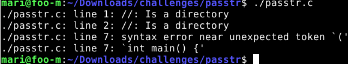

Seuraavaksi ajoin komennon `strings` tiedostoon.

```
strings passtr
```
Sieltä löytyi epäilyttävän näköinen rivi - uskon, että tuo on se oikea salasana.

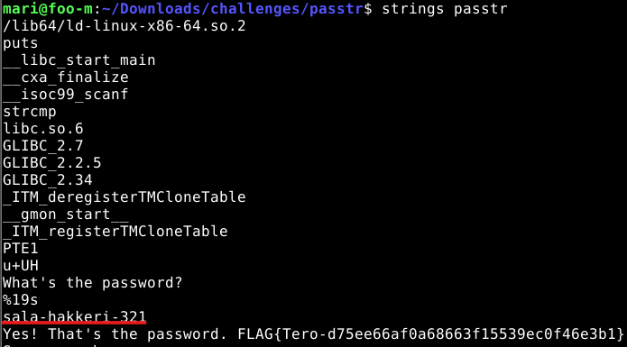

Syötin salasanan, ja näinhän se lippu löytyi!

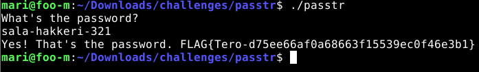

## b) Salasanan piilottaminen ohjelmasta

Seuraavaksi tehtävänä on jollakin ratkaisutavalla piilottaa salasanan esiintyminen ohjelmassa. Jotta voisin ymmärtää paremmin sovelluksen rakennetta, lähdin tutkailemaan lähdekooditiedostoa `passtr.c`.

Tiedostoon on merkitty selkotekstillä salasana. Ensimmäinen ajatus oli, että entä jos salasanan kryptaisi jollakin kirjastolla, kuten bcryptillä. Kuitenkin mitä enemmän tutkin asiaa, sitä monimutkaisemmalta tuo ratkaisu vaikutti - etenkin, koska C ei ole tuttu kieli. Googlasin tapaa, millä voisin obfuskoida salasanan, sillä tehtävänannossa tällainen ratkaisu on sallittu. Googlauksella löysin [ketjun](https://stackoverflow.com/questions/1648618/techniques-for-obscuring-sensitive-strings-in-c) Stack OverFlow:sta, jonka ylimmässä vastauksessa kerrottiin XOR-obfuskoinnista. 

Aikani ihmettelin ratkaisua ja etsin tietoa, ja päädyin lopulta kääntymään Clauden (Sonnet 5 Medium) puoleen koodausapuriksi, sillä en osaa C-kieltä alkuunkaan. Kerroin Claudelle halustani seurata Stack Overflow:ssa esitettyä ratkaisutapaa, ja Claude tarjosi minulle tällaista koodia.


KOODI ON TUOTETTU TEKOÄLYLLÄ (MALLI: CLAUDE SONNET 5 MEDIUM)
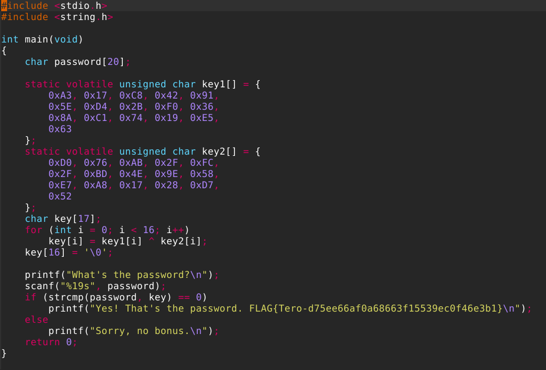

Ratkaisussa ensin tallennetaan käyttäjän syöttämä salasana puskuriin `[password20]`, ja tehdään 16-tavun taulukot `key1` ja `key2`.(`volatile`-määre estää kääntäjää laskemasta niiden XOR-tulosta valmiiksi käännösvaiheissa. Minulla oli jostain syystä ongelmia ilman tuota määrettä.)

For-silmukka käy läpi molemmat taulukot tavu kerrallaan ja yhdistää ne toisiinsa. Esim. taulukon `key1[0]` alkio + `key2[0]` taulukon alkio muodostavat bitin, joka vastaa kirjainta 's'. Esim:
- Kierros 1: `key1[0] XOR key2[0]` -> salasanan eka merkki
jne... kunnes kaikki merkit on käyty läpi. Lopputulos tallennetaan `key`-muuttujaan. 

Nyt kun ajetaan seuraava komento.
```bash
strings passtr
```
Ei enää näy salasanaa selväkielisenä.

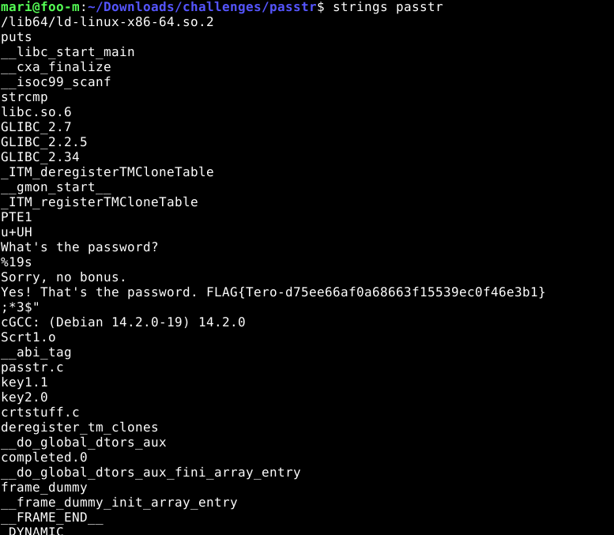

## c) packd-ohjelman salasana

Ensimmäisenä kokeilin tietenkin samaa salasanaa kuin edellisessä tehtävässä, vaikka osasin jo odottaa, ettei se tule toimimaan.

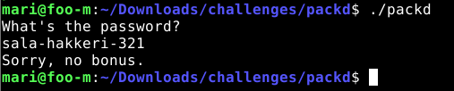

Käytin taas strings-komentoa, kuten edellisessä tehtävässä.

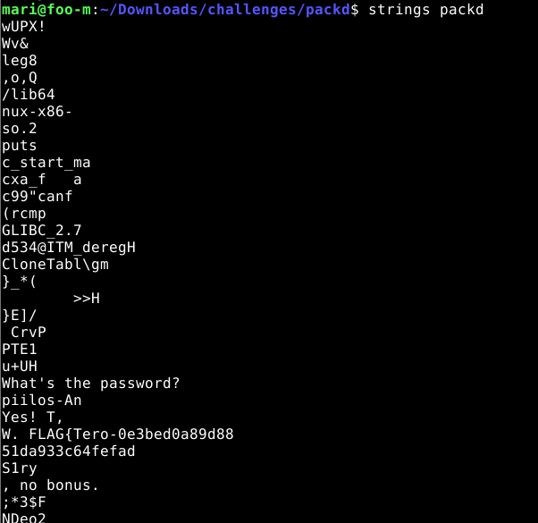

Merkkijonot näyttävät melkoisen erilaiselta verrattuna edelliseen tehtävään. Epäilen, että siinä on käytetty jonkinlaista kryptausta, joka pitäisi purkaa. Kokeilin kuitenkin huvikseni syöttää salasanaksi 'piilos-An'. Kuten arvata saattaa, ei toiminut tämäkään.

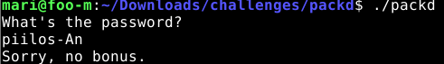

Tutkin muita strings-komennon printtaamia rivejä, ja huomasin, että tiedoston paketoimiseen on käytetty jotakin ohjelmaa nimeltä 'UPX executable packer'. Mietin, että olisikohan siihen leivottu samalla sisään jokin kryptaus-algoritmi. 

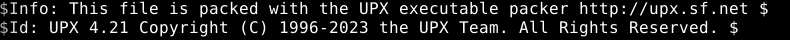

Lähdin googlettelemaan tietoa. Googlasin "upx executable packer encryption". Melkein hakutulosten kärjessä oli [artikkeli](https://astrah.medium.com/reverse-engineering-upx-packed-executable-d9ed7df2f72), jossa kuvattiin UPX:n kompressoidun tiedoston käänteismallinnusta. No nyt heräsi mielenkiinto! Voisiko olla, että sovellusta ei ole tarkoituksellisesti kryptattu, vaan se on tapahtunut "vahingossa" samalla, kun tiedostoon on käytetty UPX:n kompressiota? Eli kun sovellus paketoidaan, myös koodirivit muuttuvat, ja tämän takia selkokielinen salasana on fragmentoitunut.

Tarkistin vielä varmuuden vuoksi, käyttikö edellisen tehtävän tiedosto `passtr` UPX:ää. Ei käytä. Eli tämä tosiaan voisi olla ensimmäinen johtolanka. 

Koska artikleelissa oli niin hirveesti kirjotusvirhietä, googlasin lisää aiheesta "upx reverse engineering". Löysin [toisen artikkelin](https://www.reverseengineering.app/en/techniques/upx-packing), jossa kerrottiin komennosta, jolla voi muuttaa tiedoston takaisin alkuperäiseksi paketiksi. Latasin ensin upx:n.

```bash
sudo apt update && sudo apt install upx-ucl
```
Sitten kokeilin komentoa.

```bash
upx -d packd
```

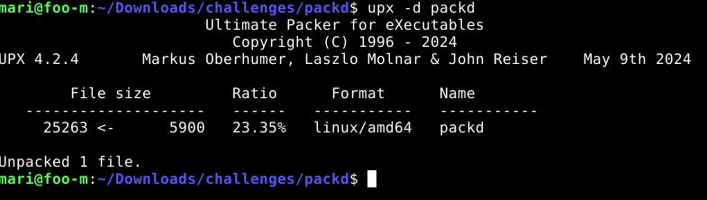

Sitten taas kokeilin strings-komentoa. No nyt näyttää jo aika lupaavalta.

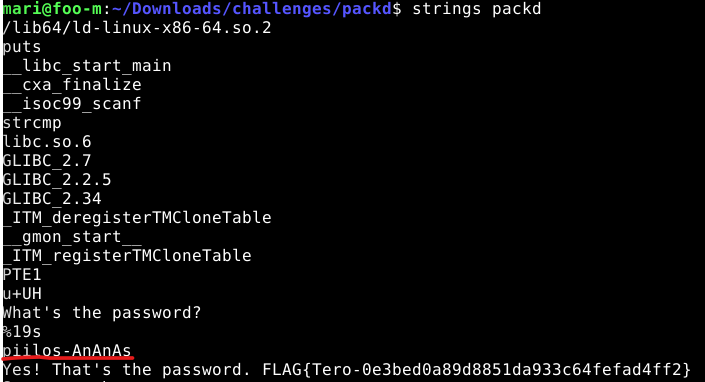

Sitten kokeilin salasanaa ja se tärppäsi!

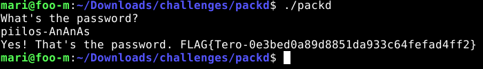


# Lähteet

Astrah 04.03.2021. Medium. REVERSE ENFINGEERING:UPX PACKED EXECUTABLE. Luettavissa: https://www.reverseengineering.app/en/techniques/upx-packing Luettu 07.09.2026.

Stack Overflow 2021. Techniques for obscuring sensitive strings in C++.
Luettavissa: https://stackoverflow.com/questions/1648618/techniques-for-obscuring-sensitive-strings-in-c Luettu 07.09.2026.

Karvinen, Tero 18.08.2026. Sovellusten hakkerointi. Luettavissa:
https://terokarvinen.com/application-hacking/#laksyt Luettu 07.09.2026.

Tehtävässä on käytetty tekoälymallia Claude Sonnet 5 Medium tehtävän b) koodinpätkän kirjoittamiseen.


