# H4 Some Disassembly Required

## x) Muistiinpanot videosta

Tehtävässä katsoin [videon](https://www.youtube.com/watch?v=oTD_ki86c9I) ltracen, stracen ja Ghidran käytöstä. Tässä päällimmäisiä asioita, jota videosta jäi käteen:

- Ltrace ja strace tutkivat ohjelman toimintaa binääristä. Ltrace listaa reaaliajassa kirjastokutsut, funktiokutsut... Voi käyttää vähän kuin "debuggerina"
- Ghidra on käänteismallinnustyökalu 
- Ghidraan voi viedä ohjelman binäärin. Sieltä voi yrittää etsiä hakemaa asiaa, kuten tiettyä stringiä tai numeroa. Videossa esimerkiksi ohjelma kysyy oikeata numeroa. Ghidralla voi etsiä mahdolliset tulokset binääristä, jos ne ovat Assembleria. Ghidralla voi mm. hakea tietyn stringin mahdollista binäärin sijaintia Assemblerissa. Löydetyn binäärikohdan voi decompileta C-kieliseksi koodiksi. Silloin voi tutkia esim. mainiä ja muita funktioita
-Videossa C-koodia tutkiessa käy selville, että syötettä verrataan ehtolauseessa heksadesimaalinumeroon, ja jos vertailu palauttaa 'true', ehtolauseen sisällä se suorittaa jonkin funktion. Tämän mysteerisen funktion voi avata näkyville ja tarkistaa itse, mitä funktio oikeastaan tekee
- Em. heksadesimaalin voi kääntää desimaaliksi. Käännetty desimaali oli oikea vastaus, ja lippu löytyi

## a) Ghidran ja JDK:n asennus

Asensin Ghidra-ohjelman Debian-virtuaalikoneelle. Seurasin osaksi edellisen tehtävän videota ohjenuorana asennukseen.

Latasin Ghidran [NSA:n GitHubista](https://github.com/NationalSecurityAgency/ghidra/releases).

Uusin versio löytyy sivun yläreunasta. 
Klikkasin auki "Assets" ja sieltä latasin zip-tiedoston.

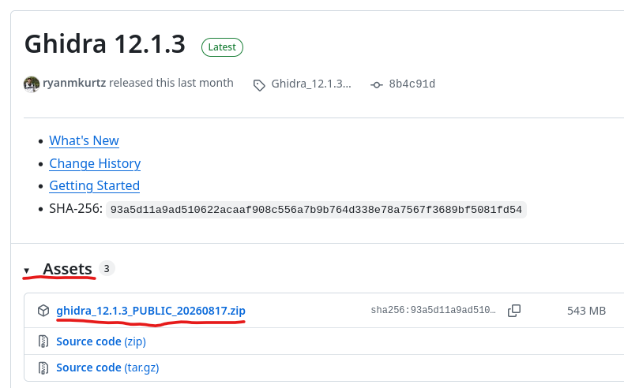

Siirsin zip-tiedoston kotihakemistoon kommennolla (tabillä täydentämisellä saa tiedoston nimen nopeasti polkuun)

`mv ~/Downloads/ghidra_12.1.3_PUBLIC_20260817.zip .`

Sitten purin zip-tiedoston.

`unzip ghidra_12.1.3_PUBLIC_20260817.zip .`

Nyt on löytyy Ghidra!

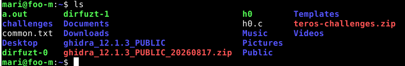

Siirryin Ghidran hakemistoon ja yrittämällä ajaa Ghidra-ohjelmaa käy selville, että sovellus vaatii JDK:n.

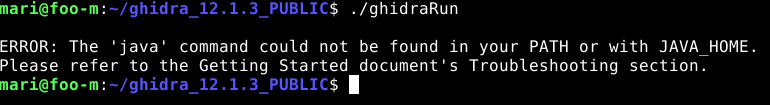

Video on 4 vuotta vanha, ja siinä käytetään vanhempaa Ghidra-versiota ja JDK:ta, mitä minä nyt 2026/09/14 käytän. Otin siis terminaalin neuvosta vaarin, ja kävin tarkistamassa tarvittavan JDK-version Ghidran GitHub-sivuilta osiosta "Get Started".

"Get Started" -osiosta käy ilmi, että vaadittava versio on Java 21 64-bit JDK. 

Latasin JDK 21:n suoraan terminaalikomennolla:

`sudo apt install openjdk-21-jdk`

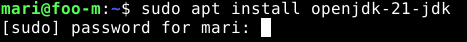

Siirryin takaisin Ghidran hakemistoon. Nyt voi ajaa ohjelmaa!

`./ghidraRun`

Tadaa!

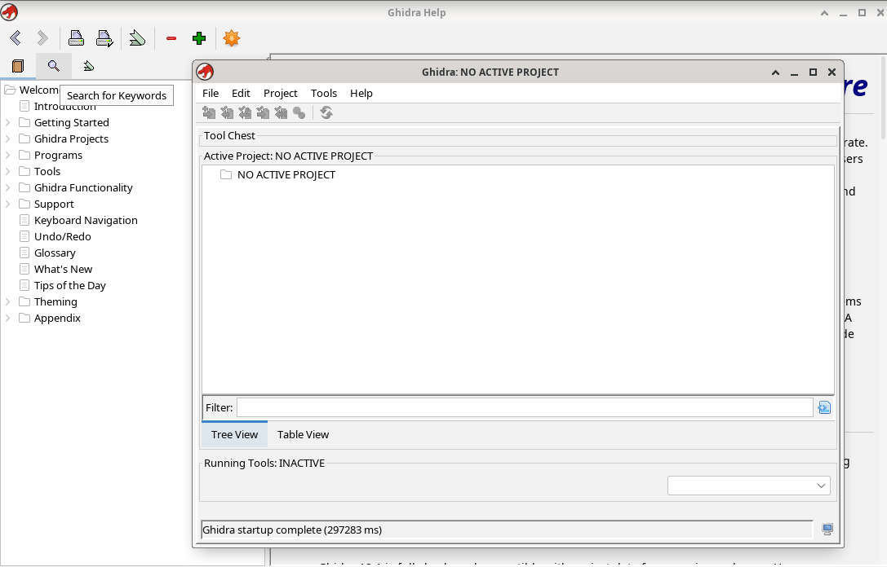

## b) rever-C: Ohjelman binäärin käänteismallinnus C-kieliseksi Ghidralla

Seuraavaksi latasin uudelleen `ezbin-challenges`-tehtävän [Tero Karvisen sivuilta](https://terokarvinen.com/application-hacking/). Nimesin tiedoston muotoon `ezbin-challenges-ghidra-zip`. Purin tiedoston suoraan Downloads-hakemistoon (laiskaa, tiedän kyllä).

Tein uuden projektin Ghidrassa. Oikeasta ylänurkasta:

File --> New Project --> Non-Shared Project. 

Tein projektille uuden hakemiston kotihakemistoon. Projektin sijainti on `home/mari/Ezbin-Ghidra`. Projektille annoin nimeksi saman, eli 'Ezbin-Ghidra'.

Seuraavaksi oikeasta ylänurkasta importoin `packd`-tiedoston:

File --> Import File... --> packd

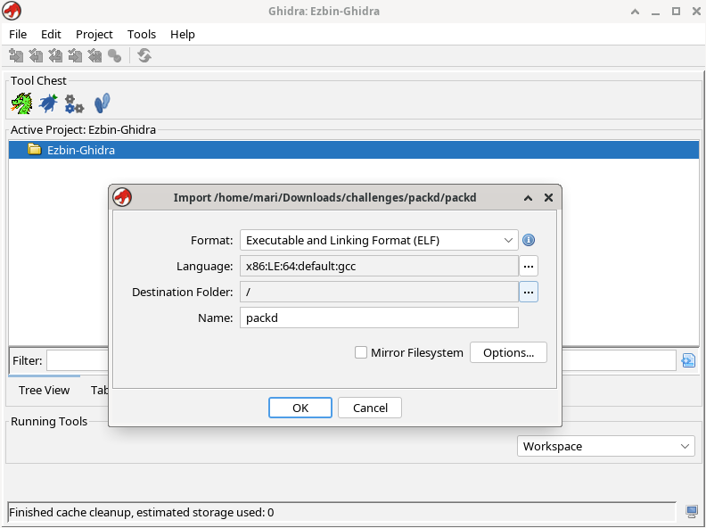

Ghidra antaa ensiksi jotakin yleistä tietoa paketista.

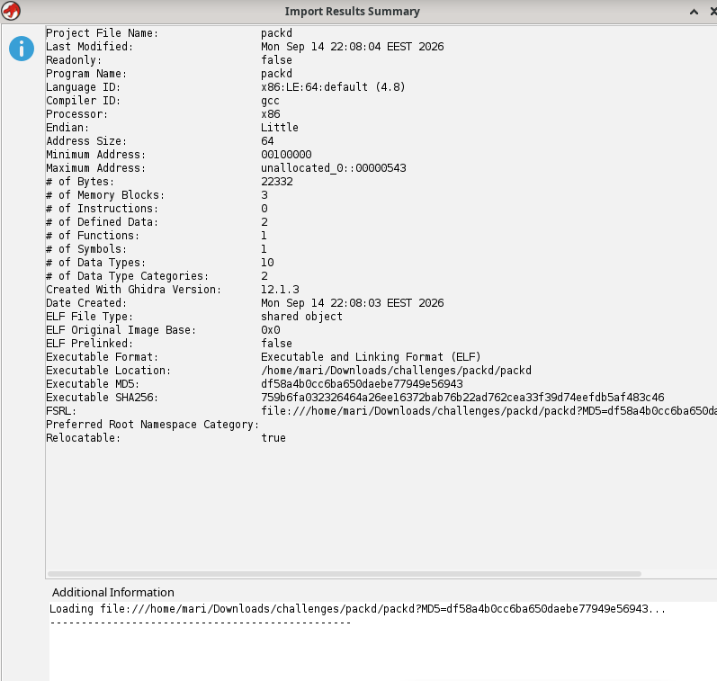

Suurinta osaa annetuista tiedoista en oikein täysin ymmärrä. Saan siitä irti lähinnä ihan perustietoja sekä esimerkiksi sen, että 'Executable Format' on tyyppiä ELF ja funktioita on 1.

Suljin tuon välilehden ja tuplaklikkasin 'packd.

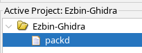

Ensin se kysyy, että haluanko analysoida paketin. Valitsen kyllä.

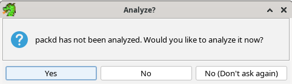

Nyt näyttää vaarallisesti siltä, että ei ole hajuakaan, että mitä näytöllä näen.

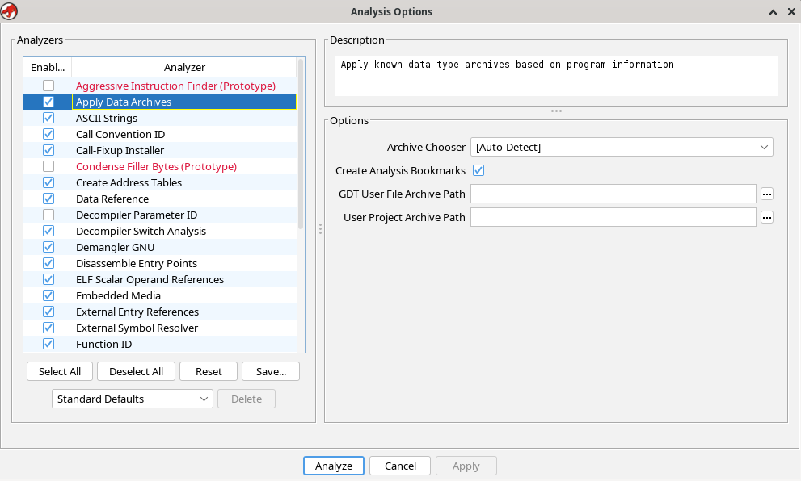

Videossa mainitaan, että sen voi antaa analysoida kaikki tiedostot, jotka Ghidra on vakiona valinnut. Selvä pyy!

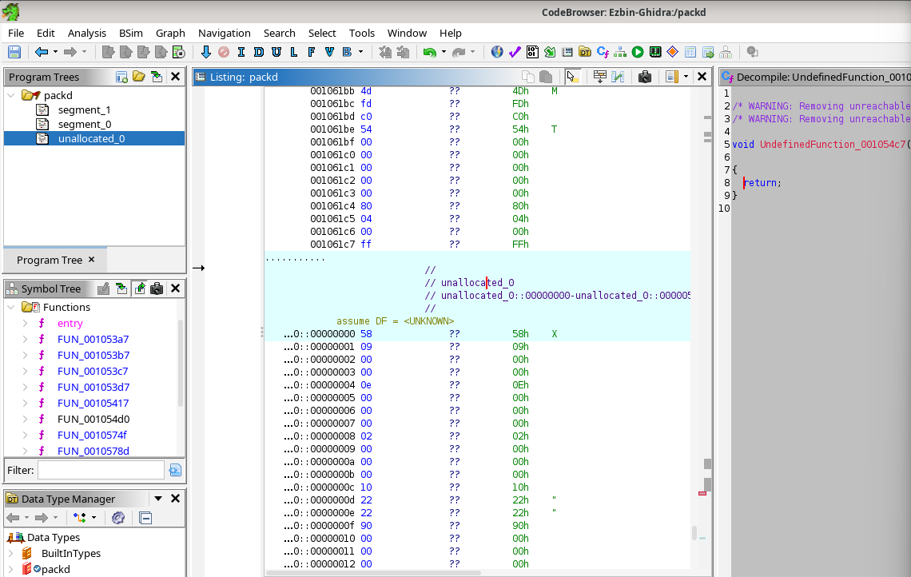

Decompilaus näyttää erikoiselta. Esimerkiksi functions-kansiosta ei löydy main-ohjelmaa. Aikani ihmettelin asiaa, kunnes muistin, että tässä tehtävässä tiedosto on pakattu UPX:llä. Menin packd-tiedostoon purkamaan UPX-paketin.

`upx -d packd`

Importoin tiedoston uudestaan Ghidraan. Nyt löytyy main-ohjelma!

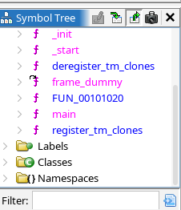

Klikkasin main-ohjelmaa, ja sieltä löytyi lippu.

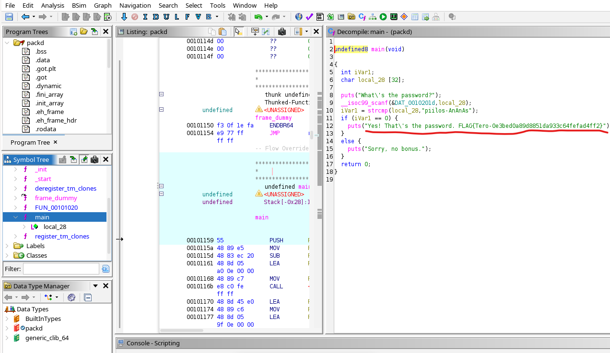

Seuraavaksi lähdin muuttamaan muuttujien nimiä. Muutin ensimmäisenä rivillä 5 olevan muuttujan `int iVarl`-nimeä. Mitä Teron tunnilta muistan, `strcmp`-funktio palauttaa nollan, mikäli eroavaisuuksia ei ASCII-merkkivertailussa löydy (=salasana on syötetty oikein). Siksi ehdon ollessa `iVarl == 0` annetaan lippu, muuten (else-haarassa) ei tule bonaria. Päätin nimetä muuttujan yksinkertaisesti `differences`. Ehkä vähän hämärä nimi, mutta tällä mennään...

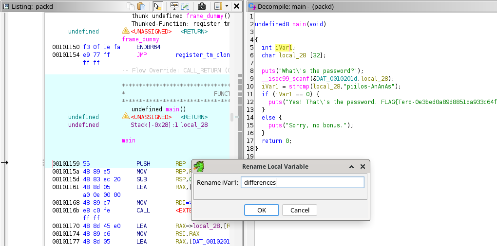

Rivillä 6 on julistettu taulukko salasanaa varten. Annan sille nimen `password`. 

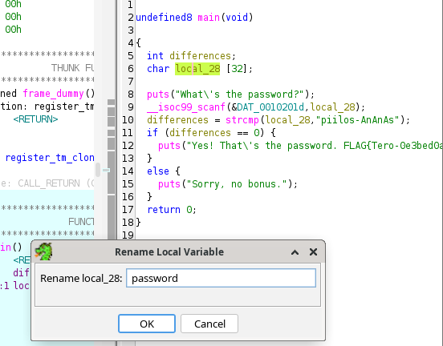

Rivillä 9 on käytetty `scanf`-funktiota. Annan sille nimeksi pelkän `scanf`.

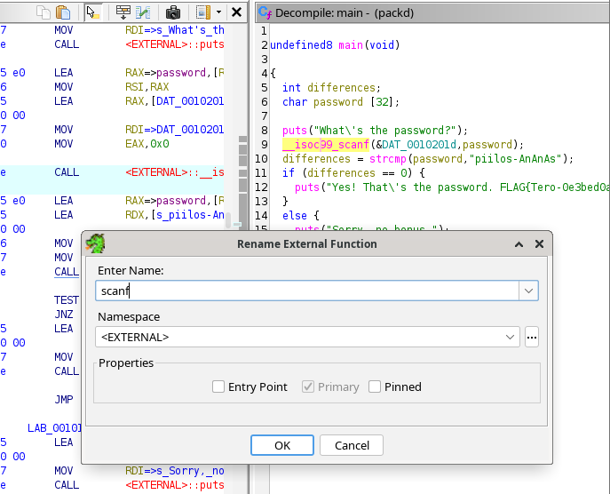

Seuraavaksi pohdin kohtaa `&DAT_0010201d`. En muistanut mitä se oli lähdekoodissa. Lunttasin GeeksForGeeks-sivustolta, että millainen parametri kuuluu tulla `scanf`:lle ensimmäiseksi parametriksi. Siihen kuuluu ilmeisesti tulla syötteen formaatti. Stringissä käytetään `%s`. Muistan, että tässä kohtaa pystyi myös merkitsemään numerona merkkirajan. Kun katsoin `&DAT_0010201d`:ia Listingissä, Assembleri on merkinnyt rajaksi ilmeisesti 19. 

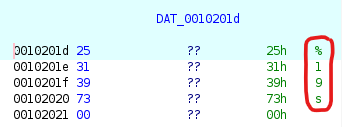

Nimesin siis `&DAT_0010201d` muotoon `%19s`. Jostain syystä eteen jäi kummittelemaan &-merkki.
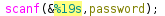

Yritin kuumeisesti Googletella, että miten merkistä pääsee eroon. Löysin [Reddit-ketjun](https://www.reddit.com/r/ghidra/comments/17rp0gd/ghirda_interpreting_values/), jossa mainitaan, että DAT tarkoittaa ilmeisesti sitä, että datan tyyppi on `undefined`, eli määrittämätön. Oikea-klikkasin sitä decompilerissa. Silloin tuli vaihtoehto `Retype Global`. Valitsin datatyypiksi `string - packd/string`. 

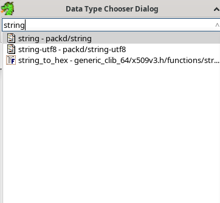

Mutta ei se toiminutkaan...

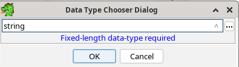

Vai että 'Fixed-length data-type required'. Kokeilin montaa eri 'string' vaihtoehtoa, mutta mikään ei toiminut. Oikea-klikkasin Listingin puolelta tuota muuttujaa, ja sieltä sain vaihdettua tietotyypiksi stringin. 

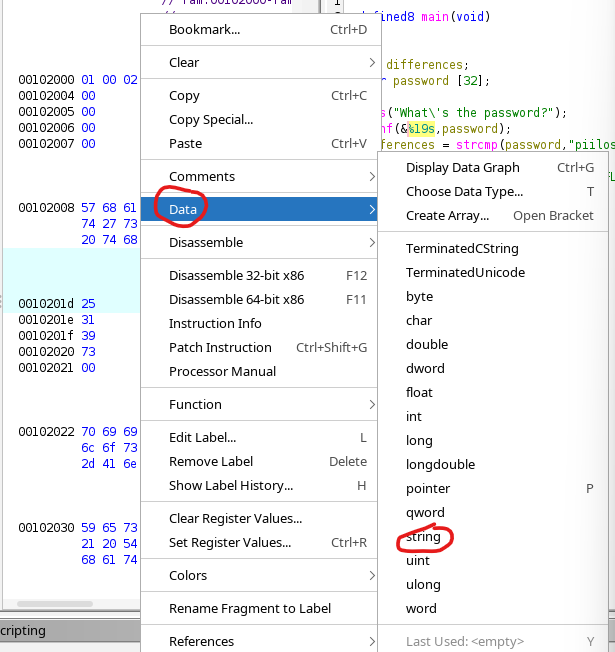

Tajusin itse asiassa nyt myös sen, että olin kirjoittanut vahingossa vain `%19s`, enkä `"%19s"`. En tiedä vaikuttiko se mihinkään.

Tajusin myös samalla, että en koskaan muuttanut ensimmäistä riviä. Siellä ei lue `int main`, vaan `undefined8 main`. Oikea-klikkasin ja valitsin 'Retype Return'. Valitsin tietotyypiksi 'int - packd/int'.

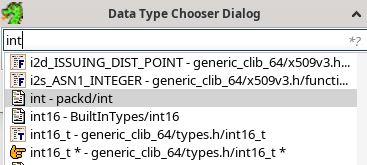

Se kyllä meni läpi, mutta nyt tuli decompileriin varoitus... 'Unknown calling convention -- yet parameter storage is locked'.

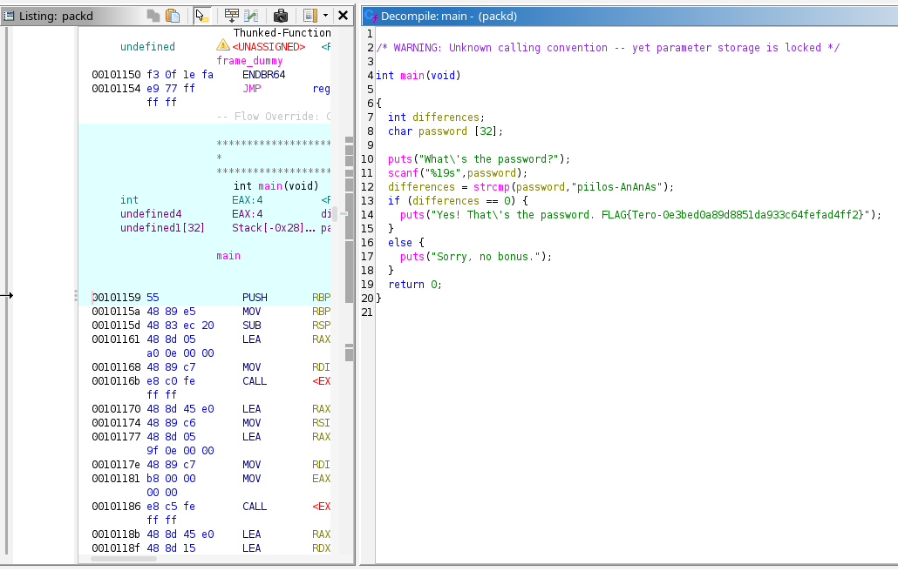

Googlasin virheen ja Googlen AI neuvoi minua. Se ehdotti, että oikea-klikkaan main funktiota ja valitsen 'Edit Function'. Sieltä valitsen Calling Conventioniksi default. Valitsin datatype-sarakkeeseen `int - packd/int`. Nyt virhe ainakin katosi. 

Tältä näyttää nyt muutettu koodi!

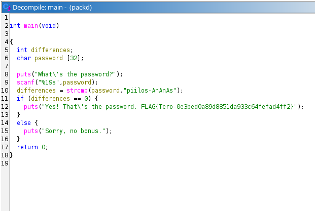

## c) Ehtolauseen muokkaaminen Assemblyssä

Importoin `passtr`-tiedoston Ghidraan ja aloitin sen tutkimisen seuraavaksi.

Tavoitteena on muokata ohjelman binääriä niin, että mikä kaikki muut salasanat kelpaavat, paitsi se oikea - eli "sala-hakkeri-321". Erittäin helppo toteuttaa C-koodina, mutta katsotaan, miten vaikeaa tämä on toteuttaa binääriin.

Aikani Googlailtua tulin siihen lopputulokseen, että melkoisen vaikeata tämän taitotason pohjalta. Assembly ei ole ollenkaan tuttu kieli, joten käytin paljon aikaa perusteiden opetteluun - kuten mitä tarkoittaa `TEST`, `LEA`, `MOV`, `JNZ` ja `JMP`. 

Kun maalaa decompilerissa tietyn kohdan, Ghidra näyttää sitä vastaavan Assembly-koodin Listingissä.
Tässä kuvassa olen maalannut sanan `if`:
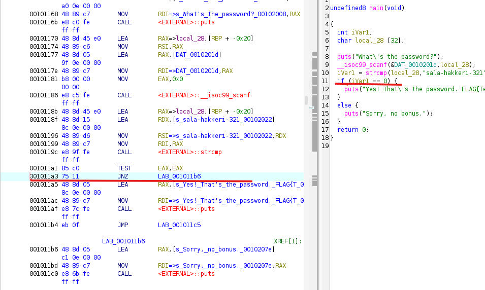

Uskon, että tämä kohta on se, mitä pitää muuttaa. Kun maalaa itse ehtolauseen `iVal == 0`, Ghidra osoittaa yhtä ylemmälle riville, jossa lukee `Test`.

JNZ tarkoittaa 'Jump if Not Zero'. Uskon tuon `LAB_0010111b6` merkisevän sitä, että tuo on se blokki, mihin ohjelma hyppää, jos arvo ei ole 0. Tämä käy järkeen, koska tuossa blokissa todetaan "Sorry, no bonus". Ohessa todella selkeä ja hieno kuva esittämään asiaa.

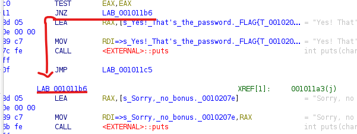

Pohdin tuota `JNZ`-määrettä. Entä jos sen saisi vaihdettua vaikkapa ehdoksi 'Jump if Zero'? Silloin ohjelman pitäisi hypätä siihen blokkiin, jossa bonaria ei anneta.

Halusin kokeilla `JZ`-määrettä ja katsoa, mitä tapahtuu. Yritin editoida Assembleria suoraan, mutta se ei onnistu. Löysin [blogin](https://blog.cjearls.io/2019/04/editing-executable-binary-file-with.html), jossa kävi ilmi ohjeet muokkaukseen. Pitää oikea-klikata ja valita 'Patch Instruction'. Tein muutoksen.

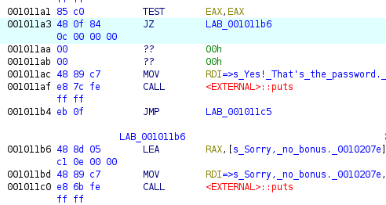

Myös C-koodi decompilerissa muuttui melkoisesti:

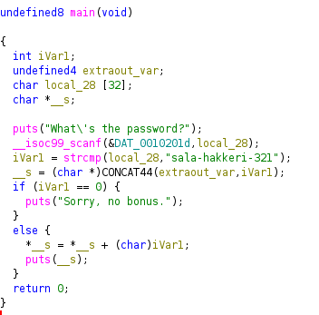

Nyt sen pitäisi hypätä else-haaraan, jos salasana täsmää. Minulla oli myös hypoteesi, että jos se ei hyppää else-haaraan (eli arvo ei ole nolla, =salasana ei täsmää), niin se jatkaa toimintaansa normaalisti. JZ-rivin alle kyllä tuli joitakin uusia rivejä, joissa on kysymysmerkkejä. Kokeilen ohjelmaa, ja jos se ei toimi, aion koittaa poistaa tai muokata noita rivejä.

Halusin kokeilla ohjelmaa, joten oikeasta ylänurkasta File --> Export Program. Valitsin tiedostoformaatiksi 'Original File' ja nimeksi 'passtr-edited'. Navigoin terminaalissa tallennettuun tiedostoon. Yritin ajaa sitä, mutta oikeudet eivät riittäneet. Käytin komentoa. 

`chmod 777 passtr-edited`

Ja sitten taas ajoin ohjelman ja syötin salasanan. Oikea salasana ei enää toiminut!

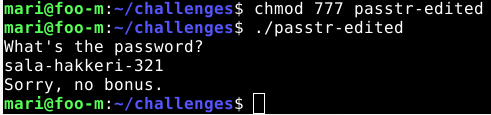

Toisaalta, ei toimi myöskään mikään muukaan syötetty sana. 

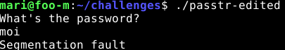

Vai että 'Segmentation Fault'. Googletuksella löytyi [artikkeli](https://medium.com/@mohamedsamer1532/understanding-segmentation-fault-in-c-causes-and-solutions-ed3d1c159d76), jonka mukaan virhe johtuu siitä, että ohjelma yrittää käyttää sellaista muistin sijaintia, johon sillä ei ole pääsyä. 

Ajattelin ensin poistaa/muokata rivejä, joihin ilmestyi kysymysmerkit. Ehkä ne ovat tällaisia "tyhjiä viittauksia"? Googlasin asiaa, mutta rivien poistamisesta tai muokkauksesta ei oikein löytynyt mitään järkevää ohjetta - uskon, että se ei ole edes tarkoituksenmukaista. Ohjelmassa on muuallakin kysymysmerkkejä ja tuskin rivejä olisi lisätty, jos niitä ei tarvitsisi.

Käännyin tässä vaiheessa tekoälyn (Claude Sonnet 5 Medium) puoleen, koska oli haastavaa löytää oman tilanteeseen sopivaa ohjetta, jonka minäkin keltanokka ymmärrän. Tekoäly pyysi minua tarkistamaan, mikä 'Byte Length' oli edellisellä JNZ:llä sekä uudella JZ:lla. Kumosin tekemäni muutokset, jotta voin tarkistaa alkuperäisen pituuden. Alkuperäisen JNZ:n pituus oli 2 tavua, kun taas lisäämäni JZ:n pituus 7 tavua. Eli se JZ minkä Ghidrasta olin valinnut, teki 'pitkän hypyn', kun taas edellinen JNZ 'lyhyen hpyyn'. On tärkeää pysyä saman pituisissa hypyissä, jotta ohjelma ei turmeloidu. 

Valitsin uudestaan JZ, tällä kertaa 2 tavun pituisena.

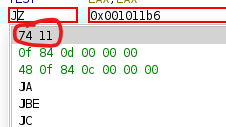

No nyt näyttää C-compilerikin järkevämmältä. Ehtojen sisäiset blokit ovat periaatteessa muuttaneet paikkaansa toisensa kanssa, joka on yksinkertaisin ratkaisu.

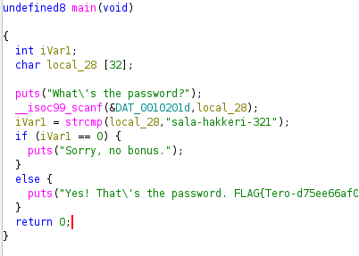

## d) Noran crackme-tiedostot

[Repositoriosta](https://github.com/NoraCodes/crackmes) löytyivät tiedostot, joita kuuluu seuraavissa tehtävissä ratkaista. Näitä ovat `crackme01`, `crackme01e` sekä `crackme02`. Latasin nämä tiedostot repositorioista Downloads-hakemistoon.

Terminaalissa menin hakemistoon ja ajoin niille komennot muodossa `make <nimi>`.

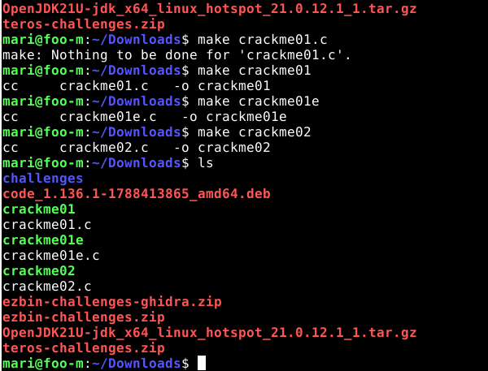

## e) crackme01

Avasin ihan ensimmäisenä `crackme`-tiedoston microssa uteliaisuuttani. Kuten kuvasta näkee, ei tästä oikein saanut mitään irti. 

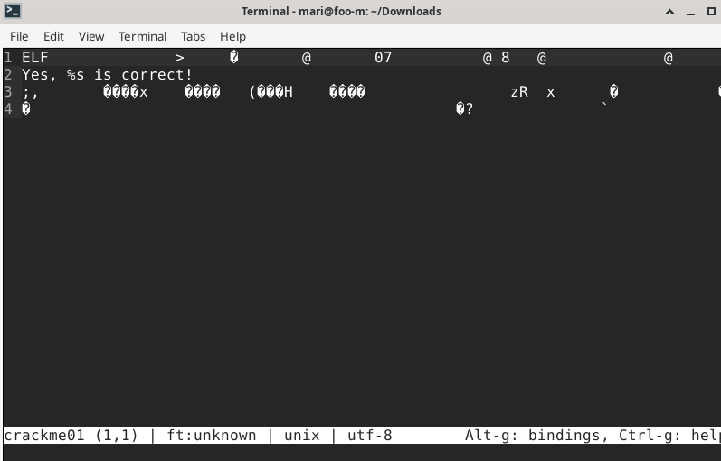

Yritin ajaa ohjelman komennolla `./crackme01`.

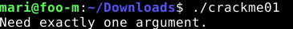

Okei, no lisätään argumentti. Se ei ilmeisesti ole 'getcracked'.

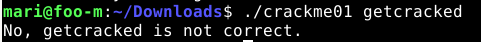

Eli periaatteessa pitäisi löytää binääristä jokin oikea parametri. Edellisissä viikkotehtävissä käytettiin komentoa `strings`, joten lähden sillä tutkimaan binääristä löytyviä merkkijonoja.

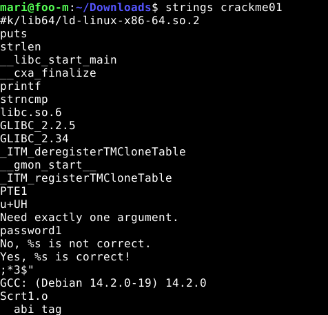

Merkkijono `password1` herätti huomioni. Kokeilin syöttää sen ohjelmaan. Se olikin oikein!

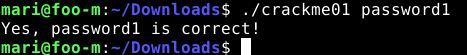

## crackme01e

Ajaessani ohjelmaa komennolla `./crackme01e` huomasin, että tämäkin tehtävä haluaa argumentin. En aio sokkona kokeilla argumentteja, vaan menen taas tutkailemaan `strings`-komennolla.

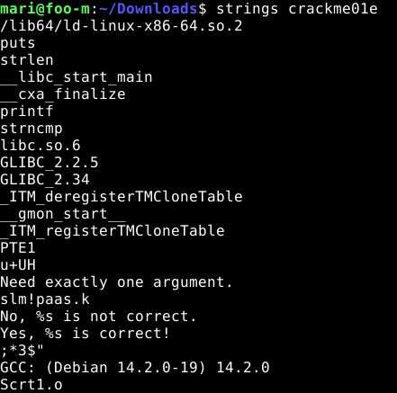

Siellä näkyvä merkkijono 'slm!paas.k' herätti huomioni. Kokeillaan sitä.

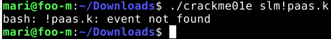

Nyt näyttää siltä, että ohjelma ei edes ottanut antaamani syötettä parametrinä, vaan yrittää ilmeisesti suorittaa jonkin toiminnon - luultavasti jonkin erikoismerkin takia. Kokeilin ensin poistaa kaikki erityismerkit argumentista, joka ei myöskään toiminut. Nyt se tosin otti argumentin.

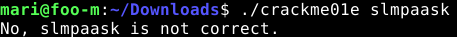

Yritin laittaa lainausmerkit argumentin ympärille. Silloinkin tapahtuu mystinen virhe. 

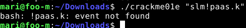

Päätin googlata "event not found bash". Löysin [ketjun](https://serverfault.com/questions/208265/what-is-bash-event-not-found), jossa neuvottiin, että huutomerkin saa mukaan argumenttiin sellaisenaan, jos laitan sitä ennen `\`. Kuten arvelinkin, huutomerkki on varattu merkki bashissä. Nyt se toimi!

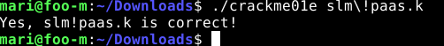

## f) crackme02

Tehtävässä on tarkoitus nimetä main-ohjelman muuttujat uusiksi käänteismallinnukseen sekä selittää ohjelman kulku. Tähän hommaan tarvitaan taas Ghidraa. 

Käyttäen em. dokumentoituja ohjeita, importtasin `crackme02`-tiedoston Ghidraan olemassaolevaan projektiini ja etsin sieltä käsiini main-ohjelman. Tältä se näytti.

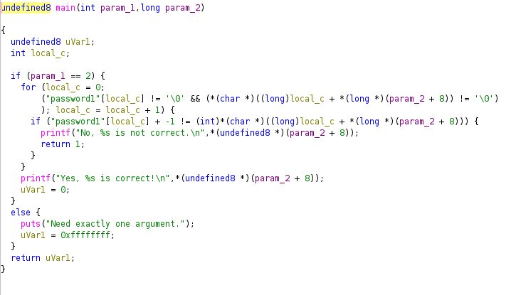

Voidaan heti todeta, että main-ohjelma ottaa 2 parametriä: yhden integerin ja yhden longin. Ohjelma saa siis ilmeisesti kaksi lukua parametreikseen. 

En vielä tässä kohtaa ihan hahmota, että mitä ovat `undefined8 uVarl` sekä `int local_c`. En oikein myöskään assemblystä ymmärtänyt, että mikä se oikeastaan on. Katselin koodia pidemmälle, ja muodostin sellaisen ymmärryksen, että `uVarl` on vain julistettu muuttuja, johon sijoitetaan '0' vasta silloin, kun salasana on oikein. Eli `uVarl`:lle annetaan 'exit code'. Tämä palautetaan lopuksi main-ohjelmalle, jolloin ohjelman suoritus lakkaa. If-lauseesta käy ilmi, että jos syötetty salasana ei ole oikein, palautetaan main-ohjelmalle '1', jonka luulen myös lopettavan ohjelman.
Jos ohjelman ensimmäinen parametri on '2', mennään for-silmukkaan. Käytännössä oletan ensimmäisen parametrin olevan aina '2', koska silmukka halutaan aina suorittaa ohjelman käynnistyessä. 

Silmukassa sijoitetaan `local_c` arvoksi '0'. Eli voisikohan `local_c` olla vain etukäteen julistettu muuttuja, jota käytännössä käytetään indeksinä silmukan läpikäymisessä? Eli toisin sanoen, se on silmukan aloitusehto?

Silmukan jatkuvuusehdoksi on asetettu itselleni aika hämärä pätkä koodia. Salasana ei näytä olevan taulukossa, jossa voitaisiin käydä alkioita läpi indeksi kerrallaan. Koodissa kuitenkin selvästi käytetään indeksiä. Oletetaan, että kovakoodattua merkkijonoa voidaan tuolla tavalla käydä läpi indeksin avulla. Ensimmäinen for-silmukan ehto on se, että indeksissä oleva merkki ei ole merkkijonon "lopetusmerkki" eli `\0`. Siinä on toisena ehtona vielä hämärämpi pätkä koodia. Jos ymmärrän sen oikein, ei haluta, että indeksissä oleva merkki + (toinen parametri + 8) eivät ole myöskään lopetusmerkki `\0`. Tuo kuvio saa minut jotenkin pohtimaan, että tässä käytetään ASCII:seen vertailua, mutta en ole siitä täysin vakuuttunut. 

Silmukan päivitys on tutun näköinen. Siinä voisi vaikkapa lukea `i = i + 1`, tai tietenkin `i++`. 

Muuten ohjelman tarkka logiikka oli minulle tosi hämärä. En osaa kunnolla selittää silmukoiden jatkuvuusehtoja. Päätin avatan sorsan viereen, jotta voisin verrata, kuinka oikeaan osuin parhailla arvauksillani. 

Binääristä decompiled C-koodi:

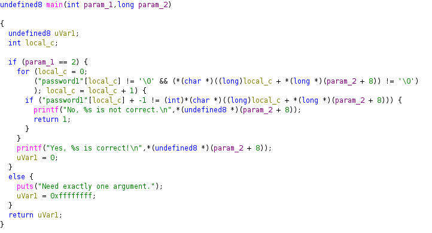

Lähdekoodi:

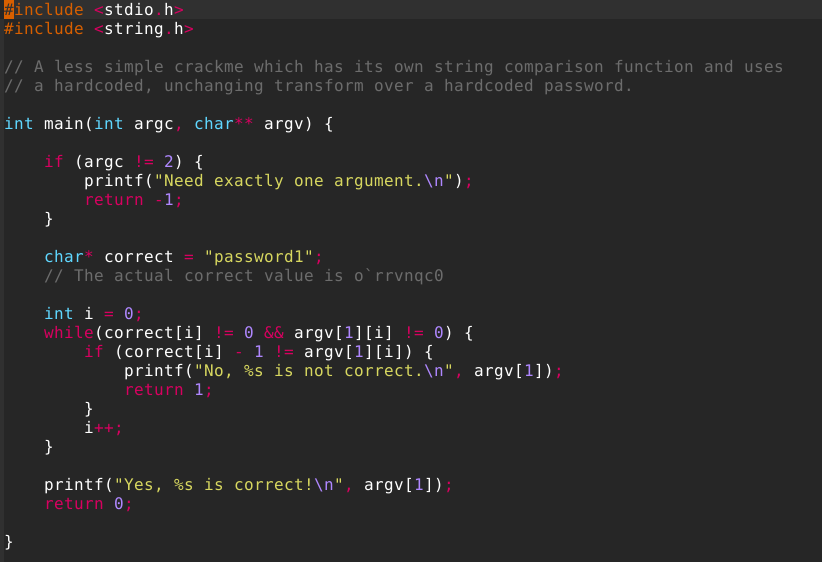

Jotkut helpot veikkaukset osuivat oikeaan, mutta vaikeammat menivät väärin. Tässä lista väärin menneistä oletuksista:

- Parametriksi ei tulekaan kahta lukua argumentiksi, vaan toinen argumenteista on `char** argv`. Tämä on itselleni uusi termi. Googletin sen ja löysin [ketjun](https://stackoverflow.com/questions/3024197/what-does-int-argc-char-argv-mean), jossa sen kerrotaan sen olevan muuttujanimi. Se tarkoittaa komentoriviltä ohjelmalle välitettyjen argumenttien taulukkoa tai listaa. Eli käytännössä se on komentoriviltä ohjelmalle annettu syöte. Näinhän crackme-tehtävät toimivat.

- En ymmärtänyt lähdekoodinkaan logiikkaa silmukoista, vaan kysyin tekoälyltä (Claude Sonnet 5 Medium) apua tulkintaan. Tekoäly selitti sen niin, että ohjelma ei vertaa käyttäjän syötettä suoraan merkkijonoon "password1", vaan se ottaa sen jokaisen merkin, vähentää sen ASCII-arvosta 1, ja vasta sitten vertaa sitä käyttäjän syötteesssä olevaan merkkiin. Jotta ehto menisi läpi (merkit täsmäävät), käyttäjän syöttämän merkin pitää olla se, mikä jää jäljelle, kun "password1":n merkeistä vähennetään yksi. Tällöin oikea salasana on siis 'o`rrvnqc0', eli obfuskoroitu versio sanasta 'password1'. 

Tässä vielä versio decompilatusta koodista, johon muutin muuttujien nimiä.

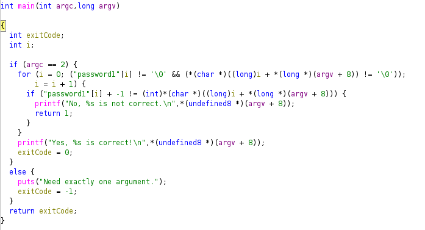

`-merkin eteen täytyi laittaa backslash, jotta se toimii:

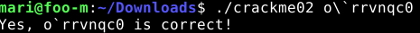

# Lähteet

GeeksforGeeks 13.10.2025. scanf in C. Luettavissa: https://www.geeksforgeeks.org/c/scanf-in-c/. Luettu: 14.9.2026.

Hamarsheh, Q. 2010. Conditional Jumps Instructions. Microprocessors (0630371), Fall 2010/2011, Lecture Notes # 18. Philadelphia University. Amman. Luettavissa: https://www.philadelphia.edu.jo/academics/qhamarsheh/uploads/Lecture%2018%20Conditional%20Jumps%20Instructions.pdf. Luettu: 15.9.2026.

Hammond, J. 27.4.2022. GHIDRA for Reverse Engineering (PicoCTF 2022 #42 'bbbloat'). Katsottavissa: https://www.youtube.com/watch?v=oTD_ki86c9I. Katsottu: 14.9.2026.

Karvinen, T. s.a. Sovellusten hakkerointi - Application hacking and vulnerabilities. Luettavissa: https://terokarvinen.com/application-hacking/. Luettu: 15.9.2026.

NationalSecurityAgency 25.03.2026. Getting Started with Ghidra. Ghidra_12.1.3_build. Luettavissa: https://github.com/NationalSecurityAgency/ghidra/blob/Ghidra_12.1.3_build/GhidraDocs/GettingStarted.md. Luettu: 14.9.2026.

NationalSecurityAgency 18.8.2026. Ghidra Releases. GitHub. Luettavissa: https://github.com/NationalSecurityAgency/ghidra/releases. Luettu: 14.9.2026.

PixelFelon 10.11.2023. Ghird[sic] interpreting values. Reddit. Luettavissa: https://www.reddit.com/r/ghidra/comments/17rp0gd/ghirda_interpreting_values/. Luettu: 14.9.2026.

Tindall, L. 2017. crackmes. GitHub. Luettavissa: https://github.com/NoraCodes/crackmes. Luettu: 15.9.2026.

Claude (Sonnet 5 Medium) tekoälyä on käytetty tehtävässä c) ongelmatilanteessa. Tekoälyä käytettiin myös tehtävän f) lähdekoodin auki selittämiseen.

