# h5 Binääri tässä, missä koodit?

Suoritin tehtävät seuraavanlaisessa ympäristössä:

- OS: Debian (64-bit) virtuaalikone
- Selain: FireFox 140.14.0esr (64-bit)
- Yhteys: NAT
- Virtualisointialusta: Oracle VirtualBox 7.2.16 r174877 (Qt6.8.0 on windows)
- GNU gdb (Debian 16.3-1) 16.3

## 1. GDB:n perusasiat

Kävimme tunnillä läpi yhdessä GNU Debuggeriin liittyviä asioita. Opettaja esitteli debuggerin käyttöä komentoriviltä esimerkkiohjelman `main.cpp` avulla.

Päällimmäisiä opittuja asioita olivat:

- GNU Debugger (eli gdb) on debuggeri jolla voidaan seurata ohjelman toimintaa lähempää. Ohjelmaa voidaan käyttää joko komentoriviltä tai laajennuksen avulla graafisesta käyttöliittymästä
- Tukee useita eri ohjelmointikieliä
- Debugattava tiedosto pitää olla ajettava tiedosto, ei esim. c-tiedosto
- `list`-komento näyttää lähdekoodin
- `layout split`-komento näyttää lähdekoodin sekä Assembly-koodin
- `break`-komennolla voi asettaa tietylle riville tai tiettyyn funktioon keskeytyspisteen (breakpoint)
- `watch <muuttuja>`-komennolla voidaan tarkkailla muuttujan arvoa ajon aikana
- `print <muuttuja>` tai `p <muuttuja>` tulostaa muuttujan sen hetkisen arvon
- `run` tai `r` ajaa ohjelman
- `step` siirtyy seuraavalle riville, mukaanlukien funktioiden sisälle
- `next` siirtyy seuraavalle riville suorittamatta funktioita
- `finish` suorittaa nykyisen funktion loppuun ja palaa kutsuneeseen funktioon

## 2. Lab 0: Debuggerin käytön harjoittelu

Tehtävässä päästään tutkimaan `lab0`-hakemiston ohjelmaa tarkemmin ja debuggaamaan sitä GDB-työkalulla (GNU Debugger). Latasin ensin tehtäväpaketit Moodlesta. Suunnistin lataamisen jälkeen kotihakemistosta Downloads-hakemistoon. 

`cd Downloads`

Downloadsista löytyy ladattu zip-kansio 'Dynaaminen analyysi-20260917.zip'.
Se on zip-muodossa, joten purin sen (samalla luoden sille uuden hakemiston kotihakemistoon).

`unzip 'Dynaaminen analyysi-20260917.zip' -d ~/H5`

Menin tutkimaan puretun hakemiston tiedostoja.

`cd ~/H5`

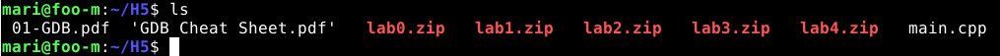

Hakemistossa on monta tehtävää. Halusin aloittaa `lab0`-hakemiston ohjelman tutkimisesta, joten purin sen ja poistin zip-hakemiston.

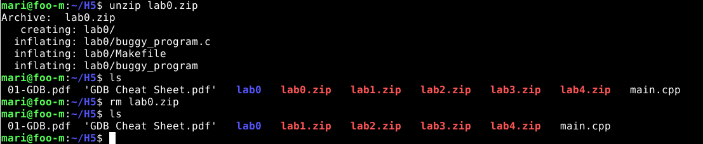

Hakemistosta löytyi c-ohjelma sekä valmiiksi myös ajettava ohjelma. 

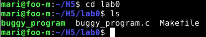

Avasin ajettavan tiedoston GDB:ssä, jotta voin aloittaa debuggaamisen. 

`gdb buggy_program`

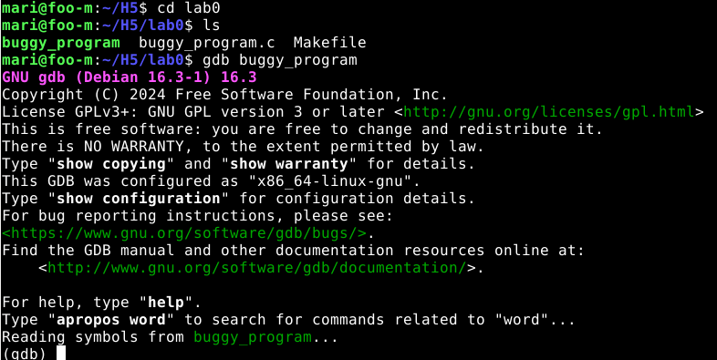

Laitoin C-ohjelman sekä Assemblyn näkyville terminaaliin komennolla:

`layout split`

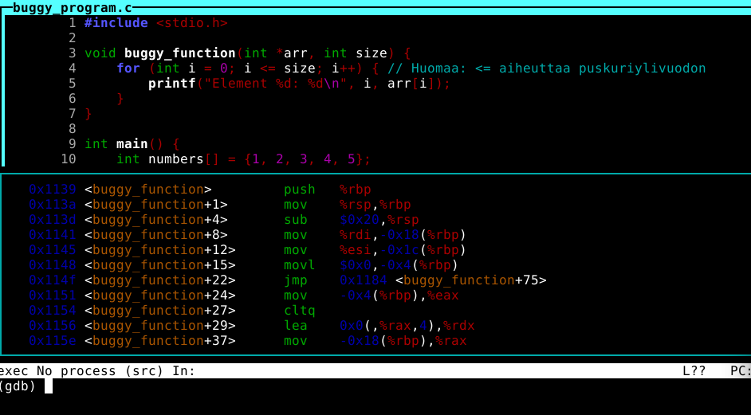

Lisäsin breakpointin funktioon `buggy_program`, jota halutaan testata. 

`break buggy_program`

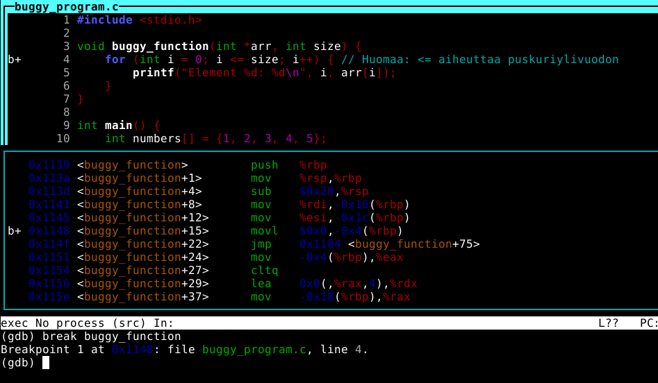

Lähdin ajamaan ohjelmaa. Tässä voi käyttää joko `run`-komentoa tai yksinkertaisesti `r`-komentoa.

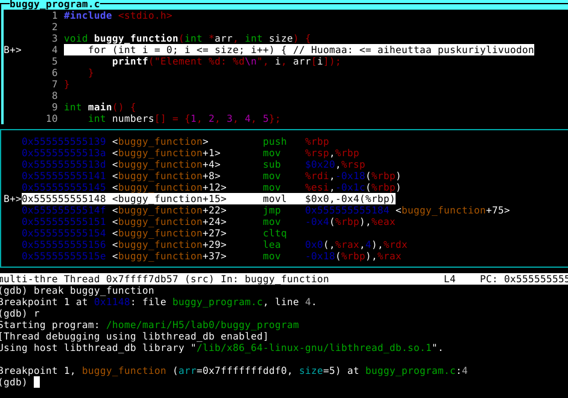

Vaikka muuttujan `size` arvo ei muutu, halusin harjoitella sen asettamista tarkkailuun.

`watch size`

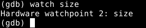

Komennolla `next` pääsin seuraavalle riville. 

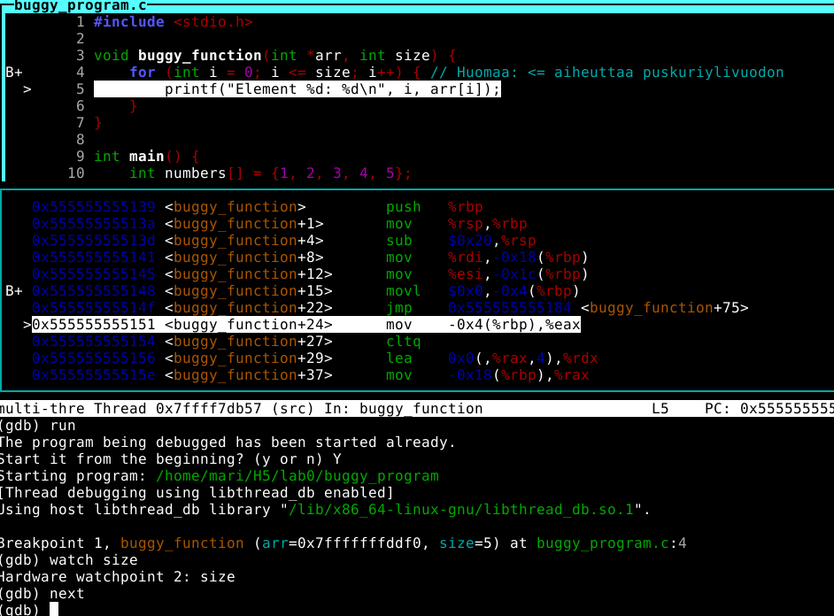

Kun halusin kokeilla muuttujan `size` arvon tarkastamista, kokeilin vähän veikkailla komentoja ulkomuistista. Ne eivät oikein auttaneet...

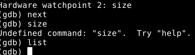

Käännyin lunttilapun (GDB Cheat Sheet) puoleen, joka oli mukana tehtäväpaketissa. Sieltä löytyi tulostuskomento, jota sovelsin:

`print size`

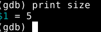 

**<<<< Pidin tässä välissä taukoa ja suljin ohjelman. Käynnistin sen tauon jälkeen uudestaan ja ajoin edelliset komennot uudestaan! >>>>**

Lähdin käymään silmukkaa läpi `step`-komennoilla. Funktio kätevästi tulostaa alkion kohdan (indeksin) sekä arvon järjestyksessä (taulukon alkiot ovat kokonaisluvut 1-5. Ne sijaitsevat taulukossa indekseissä 0-4). Koska viimeinen indeksi on 4, pitäisi lopettaa silmukka ehdolla `i < size`, eli käytännössä `i < 5`. Silloin silmukka loppuu, kun päästään viimeiseen (eli 4.) indeksiin.

Oli hieman pitkästyttävää käydä silmukkaa läpi manuaalisesti `next`-komennolla...

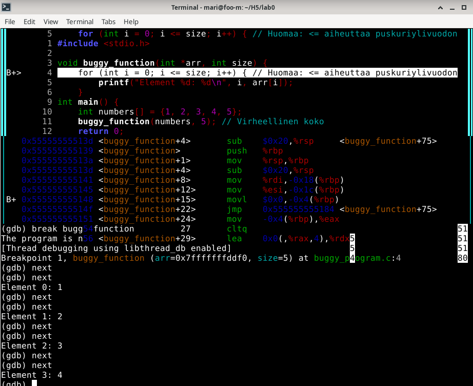

Käytin komentoa `finish`, jolla voi jatkaa nykyisen funktion return-lauseeseen saakka. En tiedä, oliko se aivan oikea komento käyttää tässä tilanteessa, mutta tämä oli output:

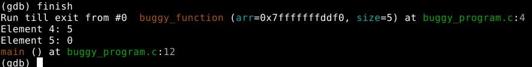

Ohjelma on tulostanut alkion '5' arvoksi 0. Tämä ei voi pitää paikkaansa, sillä taulukossa ei ole 5. alkiota. Pohdin, että tulostiko ohjelma return-lauseen arvon jostakin syystä, mutta en ole siitä täysin vakuuttunut. Tämä voisi myös olla merkki ylivuodosta.

Yritin käydä funktion läpi manuaalisesti, jolloin output oli hieman erilainen:

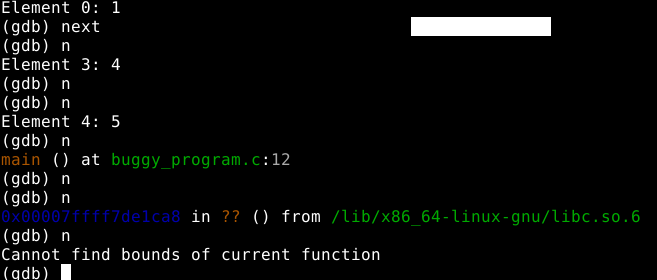

Kokeilin myös ajaa ohjelman taas uudestaan, ja kokeilin tällä kertaa komentoa `continue`.

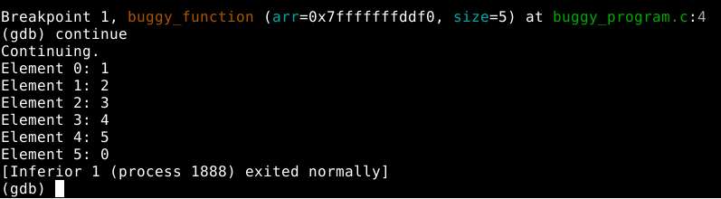

Päätin lähteä muokkaamaan sorsaa, jotta virhe saataisiin korjattua. 
Poistuin gdb:stä komennolla `q` ja siirryin microlla `buggy_program.c`-tiedostoon. 

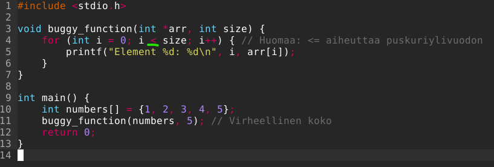

Muutin silmukan jatkuvuusehtoa muuttamalla `<=` --> `<`. Periaatteessa voisi myös muuttaa main-funktion parametrin `5` parametriksi `4.`

Poistuin microsta ja käänsin c-tiedoston ajettavaksi tiedostoksi uudestaan:

`gcc buggy_program.c -o fixed_program`

Ajoin tiedoston:

`./fixed_program`

Nyt numerot tulostuvat oikein.

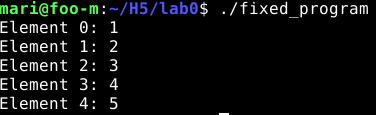

Vertaus bugiseen ohjelmaan:

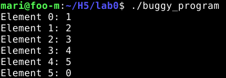

## 3. Lab1: Kaatuva ohjelma

Siirryin seuraavaan tehtävään, eli `lab1`. Purin tiedoston ja lähdin heti tutkimaan sitä. Yritin myös ajaa ohjelman.

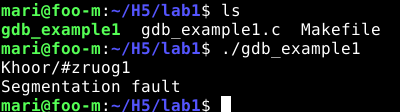

Sain pienen teaserin virheviestistä - `segmentation fault`. [Erään Reddit-ketjun vastaajan mukaan](https://www.reddit.com/r/cpp_questions/comments/1tvlrp8/can_anybody_explain_what_is_segmentation_fault/) `segmentation fault` tarkoittaa sitä, että ohjelma yrittää lukea tai kirjoittaa alustamattomaan osoittimeen, lukea taulukon lopusta eteenpäin tai päästä käsiksi johonkin, mikä ei C-kielessä ole sallittua. Toinen vastaaja mainitsi, että se voi tapahtua merkkijonojen kanssa helposti, jos unohtaa "null byte" lopusta (oletan tämän olevan edellisten viikkojen tehtävistä tuttu `\0`).

Avasin debuggerin, jotta pääsee kokeilemaan ohjelman toimintaa. 

`gdb gdb_example1`

`layout split`

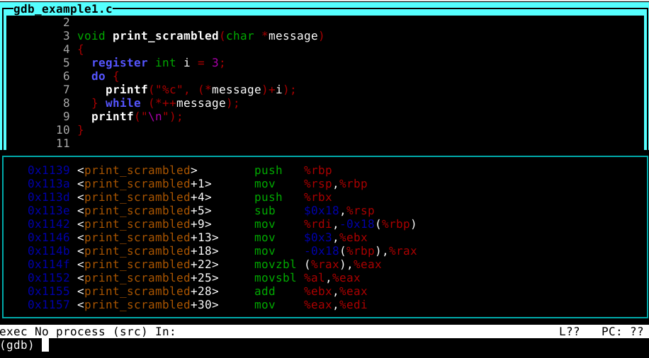

Koska C ei ole tuttu kieli, Googlasin ensimmäisenä `char *message`-parametrin merkityksen. En ollut varma, mistä `*` tulee. Luin erään [Stack OverFlow -ketjun](https://stackoverflow.com/questions/1335786/c-differences-between-char-pointer-and-array) vastaajan selityksen `char[]` ja `char *` eroihin. Kiteytettynä voisi sanoa, että se liittyy siihen, miten merkkijonoon viitataan muistissa: 
- `char message []` luo taulukon, johon tallennetaan merkit omalle muistialueelle
- `char *message` sisältää merkkijonon muistiosoitteen, ei itse merkkijonoa

Asetin breakpointin funktioon `print_scrambled` ja lähdin käymään `do while`-silmukkaa läpi. Se päätyi samaan virheviestiin.

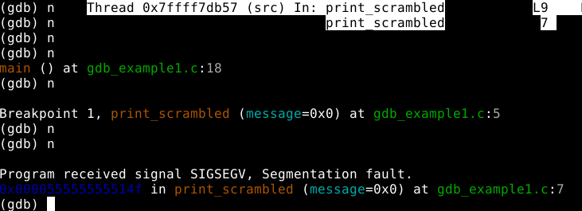

Katsoin myös main-funktion riviä `char * bad_message = null`. Pohdin, että voiko se aiheuttaa virheen, jos funktio `print_scrambled` saa parametrikseen NULL merkkijonon.

Avasin ohjelman microssa ja annoin merkkijonolle arvon:

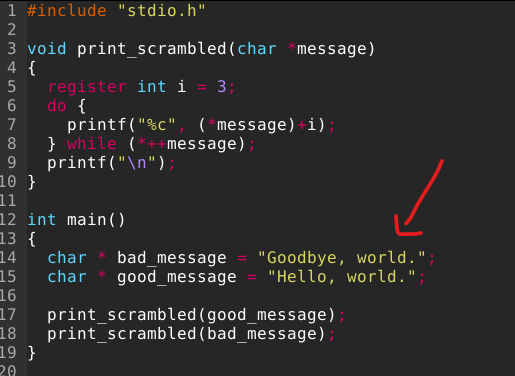

Sen muuttaminen ei vielä auttanut. Nyt on muutenkin mystiset virheviestit ajossa:

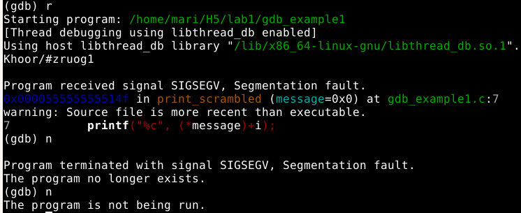

Tajusin aikani koodia ihmetellessä, että main-funktiosta puuttuu `return 0`. Kävin lisäämässä sen.

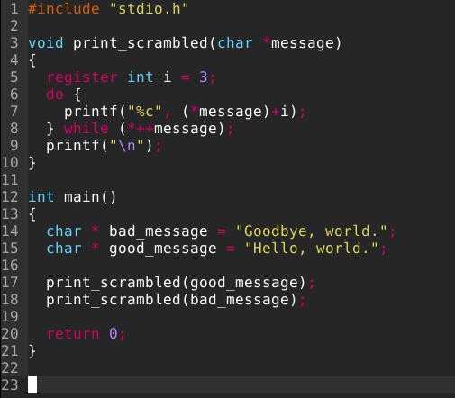

Virhe ei vieläkään korjaantunut.

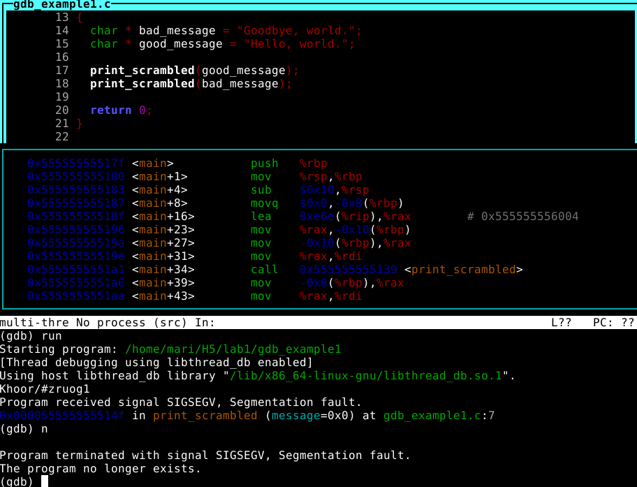

En ymmärrä, miksi ohjelma ei vieläkään toimi. Päätin kääntään sorsan uudestaan binääriksi.

`gcc -g gdb_example1.c -o gdb_example1_fixed`

Nyt ohjelma toimii!

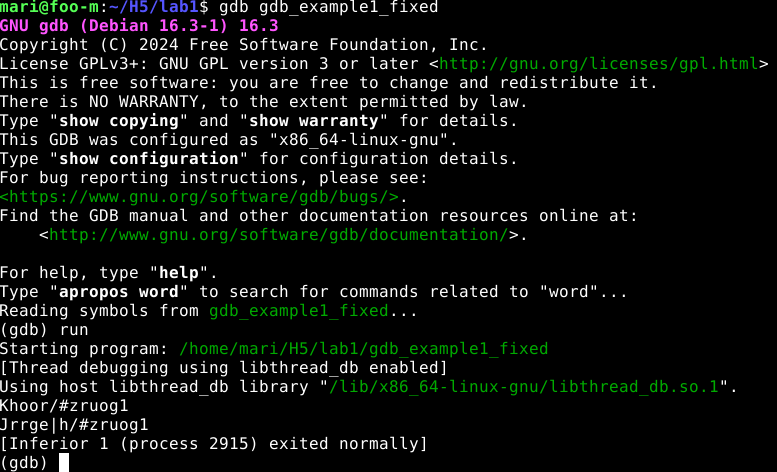

Eli jostakin syystä GDB käänsi vanhasta sorsasta. On huomautettavan arvoista, että ohjelma ei tulosta suoraan kirjattuja merkkijonoja. Se johtuu siitä, että silmukassa merkin numero-arvoa siirretään aina kolmella ASCII:ssa: `(*message) + i`. 

## 4. Lab2

Purin `lab2.zip`-tiedoston ja navigoin hakemistoon. Sieltä löytyy `passtr`-hakemisto:

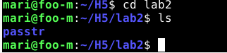

Siirryin hakemistoon, ja sieltä löytyivät seuraavat tiedostot:

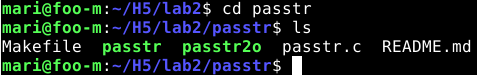

Kokeilin ajaa ohjelmaa komennolla `./passtr`:

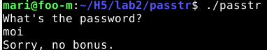

Kokeilin myös `./passr2o`:

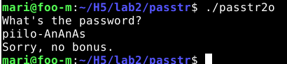

Avasin microssa C-koodin. 
`micro passtr.c`
Sieltä salasana ja lippu löytyivät.

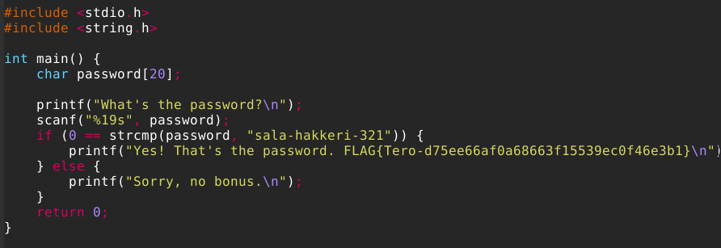

Salasana toimii, kun ajaa `./passtr`:

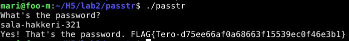

Salasana ei kuitenkaan toimi, kun ajaa `./passtr2o`:

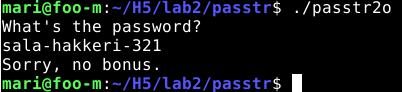

Luulen, että tehtävässä pitää ratkaista tuon ohjelman salasana. Avaan sen debuggerissa. Se ilmoittaa, että sorsaa ei ole saatavilla.

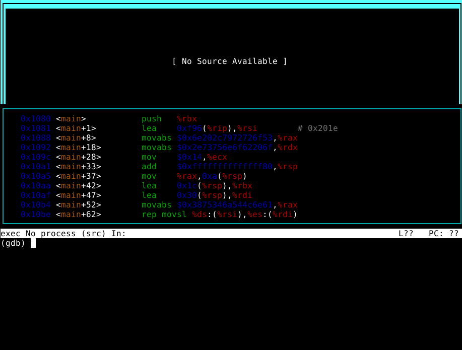

Pohdin, että voisiko salasana löytyä Assemblystä. En oikein tiennyt, että miten voisin helposti etsiä sieltä jotakin, esimerkiksi sanan 'password'. Yritin silmäillä koodia manuaalisesti, mutta se osoittautui liian vaikealukuiseksi. Googlasin, voiko merkkijonoa etsiä GDB:ssä assemblystä. Löysin [tietoa](https://undo.io/resources/gdb-watchpoint/how-search-byte-sequence-memory-gdb-command-find/) `find`-komennosta, mutta se taitaa vaatia muistiosoitteen argumentiksi - jos ymmärsin oikein. Koitan kokeilla pelkkää `find "password"`-komentoa.

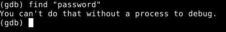

Okei, asetetaan breakpoint. En tiedä millaisia funktioita ohjelmassa on, mutta main-funktio löytyy aina.

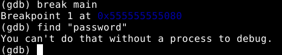

`find`-komento ei vieläkään toiminut. Päätin käyttää `n` eli `next`-komentoa.

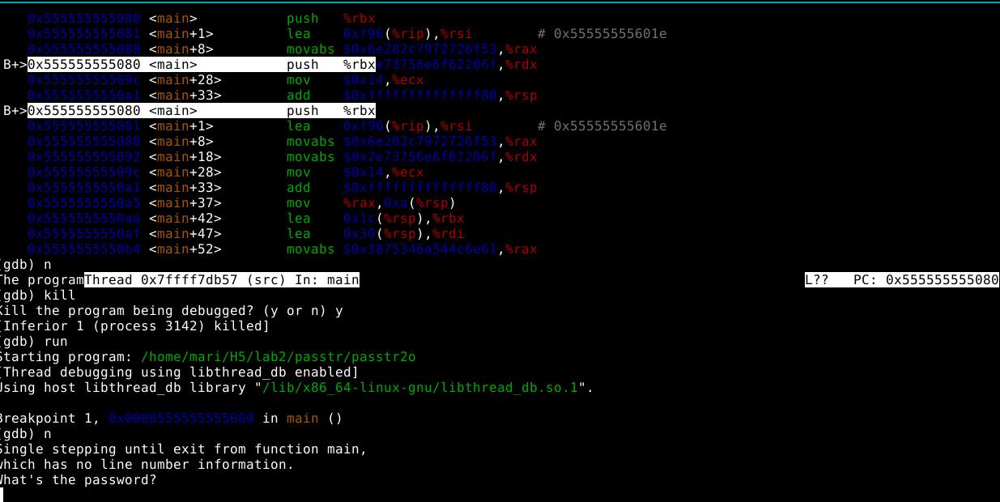

Näen nyt ilmeisesti Assemblystä sen kohdan, jossa main-funktio sijaitsee. Googlasin lisää komentoja mainin Assemblyn tutkimiseen, ja [löysin](https://visualgdb.com/gdbreference/commands/disassemble) komennon `disassemble main`. Nyt voin helpommin tutkia koodia.

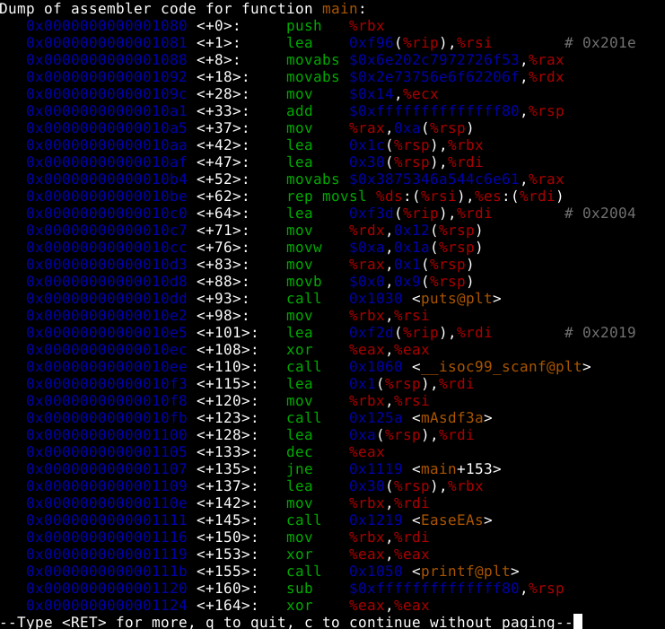

Aikani ihmeteltyä jätin tehtävän sikseen, koska se tuntui liian haastavalta. Salasanaa ei ainakaan selväkielisenä löydy Assemblystä, enkä ymmärrä, pitäisikö salasanaa etsiä tietystä muistiosoitteesta, vai miten pitäisi edetä. Siirryin seuraavan tehtävään ja päätin, että katson tätä tehtävää vielä toiste uudestaan, jos syntyisi uusia ideoita.

## 5. Lab3: Crackme03

Saimme itse valita `lab3`-hakemistossa sijaitsevan crackme-tehtävän, jonka haluamme tehdä. Purin `lab3`-hakemiston ja etsin sieltä crackme02e-tiedoston, sillä olin jo tehnyt crackme01, crackme01e sekä crackme02. 

Ohjelma haluaa oikean parametrin, aivan kuten edellisetkin tehtävät.

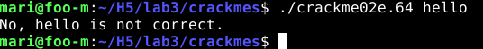

Ensin kokeilin `strings crackme02e.64`:

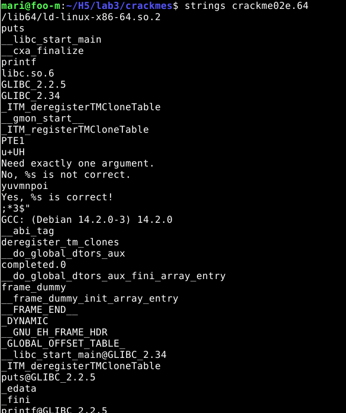

Silmääni osui merkkijono `yuvmnpoi`. Se ei kuitenkaan sellaisenaan mennyt läpi.

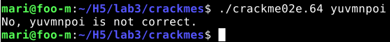

En oikein tiennyt, mitä muuta tässä tilanteessa voisi tehdä, kuin käyttää edellisiltä tunneilta tuttua työkalua Ghidraa. Siirryin Ghidran hakemistoon ja ajoin ohjelman komennolla `./ghidraRun`

Importoin `crackme02e.64`-tiedoston projektiin ja annoin Ghidran automaattisesti analysoida tiedoston (Jos lukija kaipaa yksityiskohtaisia, kuvallisia ohjeita Ghidran käytöstä, dokumentaatio löytyy [H4-tehtävän dokumentaatiosta](https://github.com/mari-sku/hakkerointi/blob/main/h4.md))!

Lähdin sitten tutkailemaan main-ohjelmaa. Se näytti decompilerissa tältä:

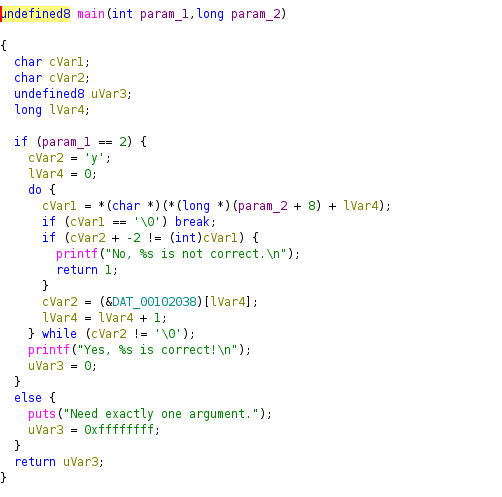

Arvelin koodista, että tässä on tehty jotakin ASCII-kikkailua. Koodia ei ollut helppo lukea, koska muuttujien nimet ja tietotyypit ovat niin kummallisia. Voin kuitenkin päätellä joitakin niistä. Nimesin ne uudelleen seuraavalla tavalla (vähän mutu-tuntumalla):

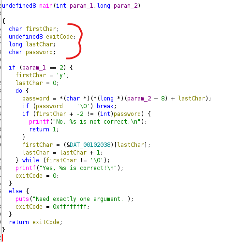

En ole ihan vakuuttunut, että 0 on olevinaan `lastChar`, vaikka tosin kyllä C-kielessä merkkijonot loppuvat aina 0:an. En halunnut kuitenkaan täysin jumittua muuttujien nimiin, joten keskityin enemmän koodissa esiintyviin ehtolauseisiin, jossa salasanaa vertaillaan.

Katsoessani tätä ehtoa pohdin, että pitäisikö merkkejä siirtää 2 merkkiä taaksepäin ASCII-taulukossa:

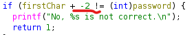

`yuvmnpoi` -2 ASCII-taulukossa = `wstklnmg`. Kokeilin sitä, ja se toimi!

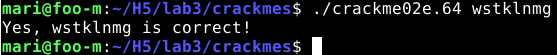

# Lähteet

Haaga-Helian ammattikorkeakoulu s.a. GBU Debugger (GDB). Sovellusten hakkerointi ja haavoittuvuudet -opintojakson esitysmateriaali Moodlessa. Luettu 18.9.2026.

Mortensen, P. & Bode, J. 16.9.2026. C: differences between char pointer and array [duplicate]. Stack Overflow. Luettavissa: https://stackoverflow.com/questions/1335786/c-differences-between-char-pointer-and-array. Luettu: 19.9.2026.

ozturk.27 28.9.2018. How to Debug C Program using gdb in 6 Simple Steps. CS Tutorials -blogi, Ohio State University. Luettavissa: https://u.osu.edu/cstutorials/2018/09/28/how-to-debug-c-program-using-gdb-in-6-simple-steps/. Luettu: 18.9.2026.

PhotographFront4673 3.6.2026. Can anybody explain what is segmentation fault? Reddit. Luettavissa: https://www.reddit.com/r/cpp_questions/comments/1tvlrp8/can_anybody_explain_what_is_segmentation_fault/. Luettu: 19.9.2026.

Sysprogs s.a. disassemble command. GDB Command Reference. VisualGDB. Luettavissa: https://visualgdb.com/gdbreference/commands/disassemble. Luettu: 19.9.2026.

Undo 16.1.2023. How to search memory for a byte sequence with GDB command find? Undo-blogi. Luettavissa: https://undo.io/resources/gdb-watchpoint/how-search-byte-sequence-memory-gdb-command-find/. Luettu: 19.9.2026.

