# h6 Laitteistohakkerointi

Suoritin tehtävät seuraavanlaisessa ympäristössä:

- OS: Debian (64-bit) virtuaalikone
- Selain: FireFox 140.14.0esr (64-bit)
- Yhteys: NAT
- Virtualisointialusta: Oracle VirtualBox 7.2.16 r174877 (Qt6.8.0 on windows)
- GNU gdb (Debian 16.3-1) 16.3

## Esivalmistelut ennen tehtävän aloittamista

Moodlen sisäisessä tehtävänannossa on tarjottu linkki dekryptausta varten olevaan [github-repoon](https://github.com/robbins/tp-link-decrypt) `tp-link-decrypt`. Latasin repon itselleni zip-tiedostona. Tämän jälkeen suuntasin `Downloads`-hakemistoon, purin zipin ja samalla tein sille uuden hakemiston.

```bash
unzip tp-link-decrypt-main.zip -d tapo-melkeen
```

Latasin myös tehtävänannossa olevan laiteohjelmiston komennolla:

`aws s3 cp s3://download.tplinkcloud.com/firmware/Tapo_C200v3_en_1.4.2_Build_250313_Rel.40499n_up_boot-signed_1747894968535.bin Tapo_C200v4_en_1.4.2.bin --no-sign-request`

Latasin myös Moodlessa sisäisesti löytyvän dump-tiedoston.

Siirsin nämä molemmat myöskin `tapo-melkeen`-hakemistoon.

Nyt kun kaikki tarvittava on ladattu, voi aloittaa tehtävän teon.

## Tapo C200 -kameran laiteohjelmiston dekryptaus

Seurasin `tp-link-decrypt`-repositorion ohjeita sen asentamiseen ja käyttöön. 

Ajoin repositorion juuresta komennon:

```bash
./preinstall.sh
```

Sitten ajoin juuresta myös:

```bash
./extract_keys.sh
```

Tämän kanssa tuli kuitenkin ongelmia. Avaimet eivät ilmestyneet `include`-hakemistoon, kuten niiden olisi pitänyt. Käännyin Clauden apuun, jolta selvisi, että pitää asentaa erikseen tarvittavia työkaluja, kuten `squashfs-tools`, `mtd-utils`, `python3-pip`, `ubi_reader` sekä `jefferson`.


```bash
sudo apt update
sudo apt install -y build-essential git wget xxd binutils binwalk \
mtd-utils squashfs-tools zlib1g-dev liblzo2-dev liblzma-dev \
python3-pip python3-venv pipx`
```

```bash
pipx ensurepath
source ~/.bashrc

pipx install ubi_reader
pipx install jefferson
pipx inject jefferson python-lzo`
```
Komentojen jälkeen sain onnistuneesti avaimet `include`-hakemistoon:

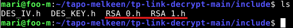

Tämän jälkeen menin `bin`-hakemistoon. Siirsin sinne `Tapo C200v4_en_1.4.2.bin`-tiedoston ja ajoin komennon:

```bash
`make`
```

Se teki tiedoston nimeltä `make Tapo C200v4_en_1.4.2.bin.dec`.

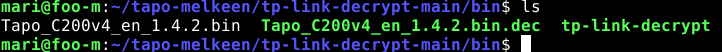

Dekryptatusta tiedostosta saa melkoisesti enemmän irti kuin alkuperäisestä tiedostosta.

Alkuperäinen:

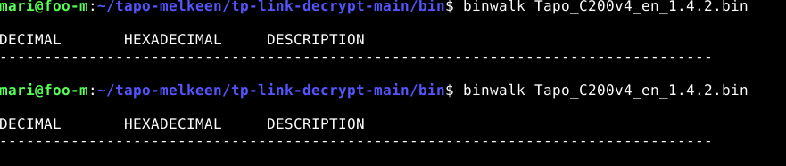

Dekryptattu:

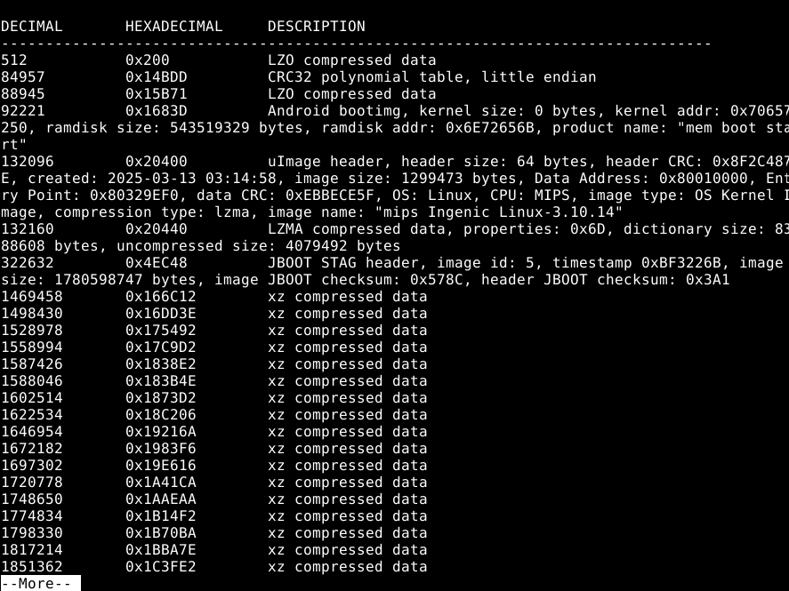

## Laiteohjelmiston image-kuvan analysointi ja sen `rootfs` purkaminen

Ajoin komennon `binwalk Tapo C200v4_en_1.4.2.bin.dec` ja lähdin tutkimaan tarkemmin, millaista tietoa sieltä löytyy. Tein seuraavia havaintoja:

- Laiteohjelmiston käyttöjärjestelmä on Linux, ja imagen nimi on 'mips Ingenic Linux-3.10.14'. Googletuksella selvisi [Wikipediasta](https://fi.wikipedia.org/wiki/MIPS-arkkitehtuuri), että MIPS on suoritinarkkitehtuuri.
- Suurin osa binääristä oli pakattua dataa

Kysyin Claudelta apua tiedoston analysoimisessa. Se huomautti, että lopussa mainitaan mielenkiintoinen kohta: Siellä on pakattu Squashfs filesystem. 

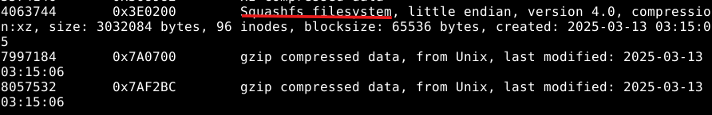

Palaamme pakatun filesystemin purkamiseen kohdassa

Sen pystyi purkamaan `unsquash`-komennolla:

```bash
dd if=Tapo_C200v4_en_1.4.2.bin.dec of=rootfs. squashfs bs=1 skip=4063744 count=3032084
unsquashfs rootfs. squashfs
```

Purettu hakemisto löytyy nyt bin-hakemistosta:

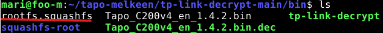

Sisältö näyttää tältä:

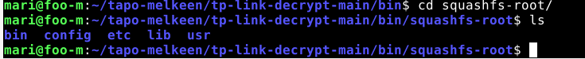


## 3. `rootfs` purkaminen dump-tiedostosta

Tässä välissä käyn katsomassa dump-tiedostoa tarkemmin, jotta voisin siitäkin purkaa `rootfs`.

Tarkistin ensin, onko tiedostoa kryptattu:

```bash
binwalk dump-tapo-c200v3-1.4.2.bin
```
Sitä ei olla ilmeisesti salattu:

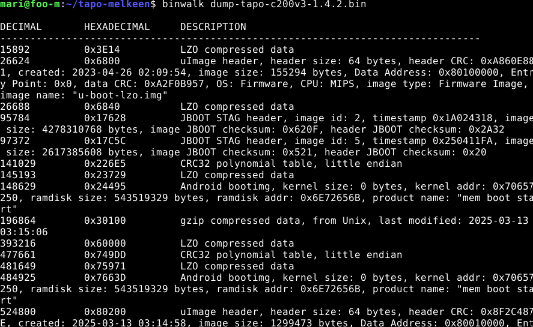

Suoritin `unsquash`-komennon tiedostolle:

```bash
dd if=dump-tapo-c200v3-1.4.2.bin of=rootfs-v3. squashfs bs=1 skip=4456448 count=3032084
unsquashfs -d squashfs-root-v3 rootfs-v3. squashfs
```

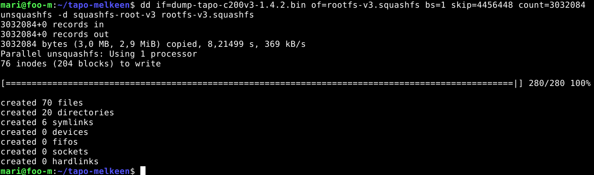

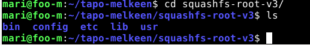

## Sovellusten etsintä

Etsin sovelluksia dump-filestä.

Sovellus sisältää main-ohjelman. Avasin sen Ghidralla, jotta voin tutkia sitä tarkemmin. En ollut varma, minkä MIPS variantin valitsen, kun Ghidra kysyi kieltä. Clauden mukaan tämä on oikea valinta:

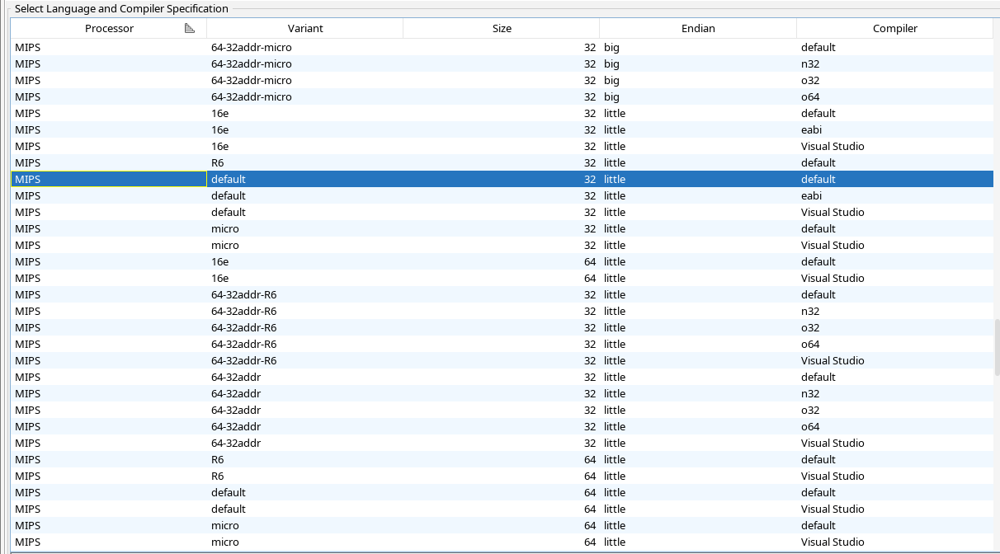

Tutkin main-ohjelmaa funktioita Clauden avulla. Se sisälsi ainakin seuraavanlaisia toiminnallisuuksia:

- WiFi-hallintaa
- Salaus (käytetty AES- ja SHA-operaatioita verkkoliikenteen suojaukseen)
- Lisää salaista (TLS-yhteydet, RSA-avainten käsittely, Base64-koodaus)
- RTSP-striimin istunnonhallinta

Ohjelma sisältää myös apuohjelmiaja ulkoisia kirjastoja, kuten `hostapd`, `iperf` js `logcat`. 

## Salasanan etsintä

Tiedostoja oli melko paljon, joten käytin `grep`-komentoa, jotta voin etsiä osumia sanoihin 'password' tai 'passwd'. En ollut ennen käyttänyt 

```bash
grep -rEin "password|passwd" squashfs-root-v3/
```
- r = rekursiivinen haku
- E = jotta putki | toimii
- i = ei välitä kirjainkoosta
- n = näyttää tiedostonimen ja rivinumeron osumien kohdalla

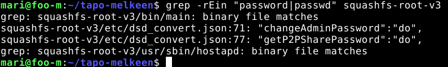

Kiinnostuksen herätti osumat binääritiedostoissa, sijainneissa `squashfs-root-v3/bin/main` sekä `squashfs-root-v3/usr/sbin/hostapd`. Siirryin niiden hakemistoihin ja tutkin niitä ensin `strings`-komennolla. Aloitin mainista:

```bash
strings main
```

Sieltä löytyi sana "password", mutta ei itse salasanaa, vaan validaatioviestejä.

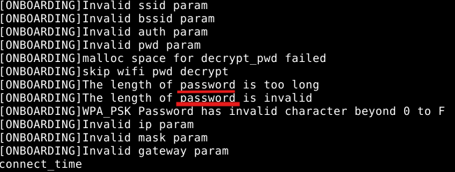

Kävin kurkkaamassa hostapd-tiedostoa. Sieltä löytyi tällainen rivi:

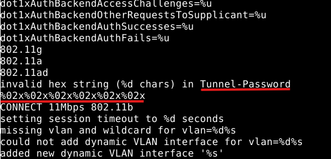

Googletin 'Tunnel-Password hostapd', ja [Linux Wireless documentation](https://wireless.docs.kernel.org/en/latest/en/users/documentation/hostapd.html)- sivustolta kävi ilmi, että se liittyy jonkinlaiseen tietoliikenneprotokollaan, eikä itse salasanaan.

Selasin muita tiedostoja, mutta jäin pahasti jumiin. En saanut salasanaa (ainakaan toistaiseksi) selville.

## Tapo C200 -kameran ohjelmiston turvallisuus

Aiemmissa vaiheissa tutustuin jo laiteohjelmistoon ja sen binääriin jonkin verran.

Sain selville `binwalk`-komennon avulla, että mitä kerneliä ja piiriä laiteohjelmisto käyttää. 

`binwalk Tapo_C200v4_en_1.4.2.bin.dec`

Se antaa seuraavanlaista tietoa: 
- OS: Linux
- CPU: MIPS
- Piiri: mips Ingenic Linux-3.10.14

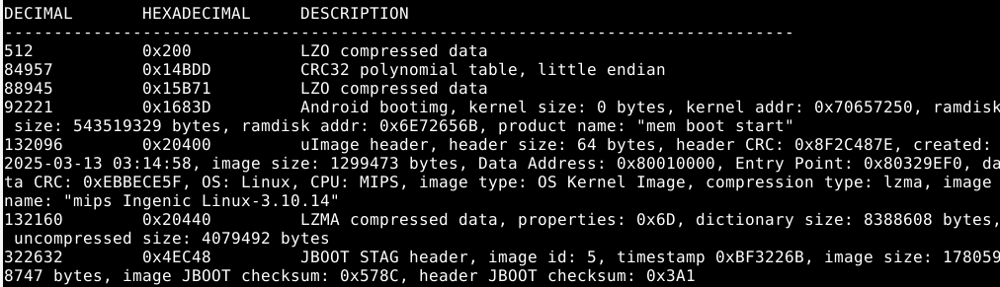

Binääri sisältää lukuisia partitioita: [Quentin Kaiserin artikkeli](https://quentinkaiser.be/security/2025/07/25/rooting-tapo-c200/) mainitsee, että laite on jaettu erillisiin `rootfs` ja `rootfs_data`-osioihin. Tutkin jälkimmäistä.

Ohjelmistossa ei oletettavasti ole myöskään kovakoodattua salasanaa, jonka totesin tutkiessani hakemistoa `strings`- sekä `grep`-komennoilla hakusanoilla 'password' ja 'passwd'.

Claude havaitsi myös sellaisia asioita ohjelmiston turvallisuudesta, jotka menivät itseltä täysin ohi. Koska omat tietoni ohjelmiston turvallisuuden arvioimisesta ovat aika rajalliset, halusin tutkia, millaisia haavoittuvuuksia voi esimerkiksi olla.

Ajamalla komennon `file bin/main` ohjelmiston hakemistossa käy selville, että `main` on stripped (=riisuttu, eli poistettu debugging tiedot ja symbolitaulut).

Ghidrassa kuitenkin näkyy `.dynsym`-niminen taulu:

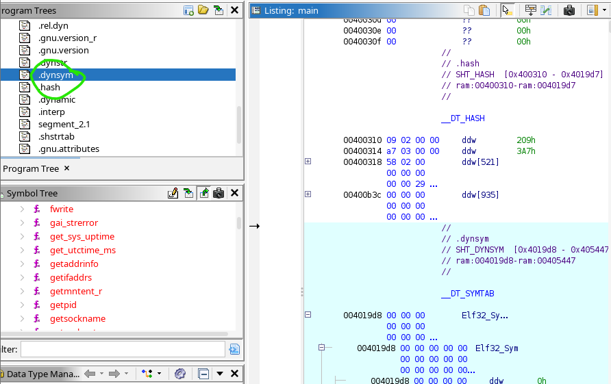

Komennolla voimme todeta, että `.dynsym` sisältää 274 nimettyä funktiota:

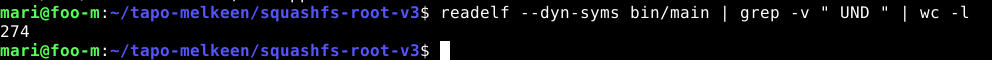

Ilmeisesti `file`-komento tarkistaa vain `.symtab`-taulun, muttei kerro mitään `.dynsym`-taulusta, sillä binääri on dynaamisesti linkitetty.

Ohjelmistossa on käytetty `mbedTLS`-kirjastoa salaukseen. Tämän voi todeta komennolla, joka näyttää, että osumia on 107:

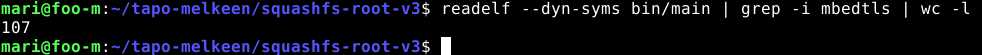

[Quentin Kaiserin artikkelissa](https://quentinkaiser.be/security/2025/07/25/rooting-tapo-c200/) mainitaan myös, että binääreissä ei ole käytössä binary hardening -mekanismia (=menetelmä, jolla tehdään binääristä vaikeampaa hyökätä). Käytössä ei ainakaan ole NX-, Stack Canary-, PIE/ASLR- tai RELRO -menetelmiä. Main-binäärin pino on suoritettavissa.

Tarkistin näiden mekanismien puutteet itsekin.

Binäärin tyyppi on suoritettava = ei PIE/ASLR:ää:

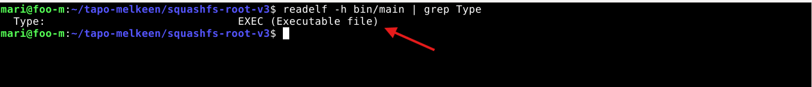

Pino on suoritettavissa = ei NX:ää:

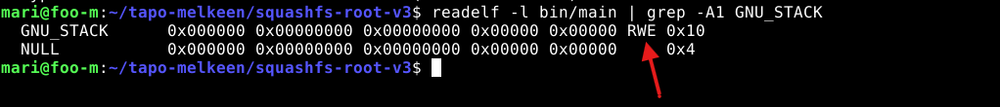

Tyhjä tulos = ei RELRO:a:

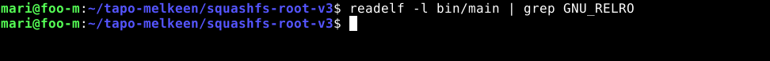

Tyhjä tulos = ei Stack Canaryä:

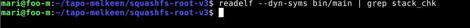

Kun hardening ei ole käytössä, voi hyökkääjä muuttaa ylivuodon oikeaksi koodin suoritukseksi. Hardening ennaltaehkäisee tällaisen tapahtumista.

Toinen asia, jonka huomasin, oli debug-työkalun olemassaolo tuotanto-ohjelmistossa. Hakemistosta `bin` löytyy binääri `gdbserver`, joka on etädebuggaustyökalu. 

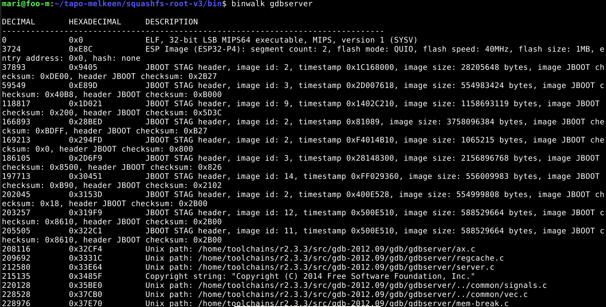

Tutkin Ghidralla, millaisia funktioita sieltä löytyy:

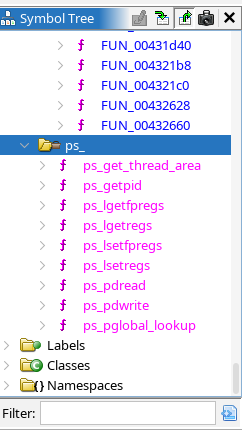

Näitä funktioita käytetään säiekohtaisessa debuggauksessa. Esimerkiksi:
- `ps_thread` ja `pas_pdwrite` lukee/kirjoittaa muistia kohdeprosessista
- `ps_get_thread_area` hakee säiekohtaisen muistialueen


# Lähteet

- [tp-link-decrypt GitHub -repo](https://github.com/robbins/tp-link-decrypt)
- [MIPS - Wikipedia](https://fi.wikipedia.org/wiki/MIPS-arkkitehtuuri)
- [hostapd Linux Wireless documentation](https://wireless.docs.kernel.org/en/latest/en/users/documentation/hostapd.html)
- [Quentin Kaiserin: Rooting Tapo C200](https://quentinkaiser.be/security/2025/07/25/rooting-tapo-c200/)